# Introduction to C++
---
## Course 1: Welcome


**Standard Library**


**Compilation**


**Build Tools**


**Installation**


**Editors**


**Style**

**Debugging**

**Introduction to Workspaces**

**Notebook Workspaces**


**Terminal Workspaces**


**Desktop Workspaces**


**Submitting Projects**


**Resetting and Refreshing Workspaces**


**What It Takes**

**Getting Help**

**Mentor Help**


**Submitting Classroom Feedback**


**Help Center**

**Udacity Support Community**

**Plagiarism**


## Course 2: C++ Foundations
**The Core Guidelines**


**CODE: Write and Run Your First C++ Program**


**Compiled Languages vs Scripted Languages**

**CODE: Send Output to the Console**


**Bjarne Introduces C++ Types**

**Primitive Variable Types**

**Vectors**


**Comments**

**Using auto**


**CODE: Store a Grid in Your Program**


**Getting Ready for Printing**

**Working with Vectors**


**For Loops**


**CODE: Print the Board**

```C++
#include <iostream>
#include <vector>
using std::cout;
using std::vector;

void PrintBoard(const vector<vector<int>> board) {
  for (int i = 0; i < board.size(); i++) {
    for (int j = 0; j < board[i].size(); j++) {
      cout << board[i][j];
    }
    cout << "\n";
  }
}

int main() {
  vector<vector<int>> board{{0, 1, 0, 0, 0, 0},
                            {0, 1, 0, 0, 0, 0},
                            {0, 1, 0, 0, 0, 0},
                            {0, 1, 0, 0, 0, 0},
                            {0, 0, 0, 0, 1, 0}};
  PrintBoard(board);
}
```
**If Statements and While Loops**


**Reading from a File**


**CODE: Read the Board from a File**


```C++
#include <fstream>
#include <iostream>
#include <string>
#include <vector>
using std::cout;
using std::ifstream;
using std::string;
using std::vector;


void ReadBoardFile(string path) {
  ifstream myfile (path);
  if (myfile) {
    string line;
    while (getline(myfile, line)) {
      cout << line << "\n";
    }
  }
}

// PrintBoard not used in this exercise
void PrintBoard(const vector<vector<int>> board) {
  for (int i = 0; i < board.size(); i++) {
    for (int j = 0; j < board[i].size(); j++) {
      cout << board[i][j];
    }
    cout << "\n";
  }
}

int main() {
  // TODO: Call the ReadBoardFile function here.
  
  // Leave the following line commented out.
  //PrintBoard(board);
}
```
**Processing Strings**


**Adding Data to a Vector**


**CODE: Parse Lines from the File**


**CODE: Use the ParseLine Function**

```C++
#include <fstream>
#include <iostream>
#include <sstream>
#include <string>
#include <vector>
using std::cout;
using std::ifstream;
using std::istringstream;
using std::string;
using std::vector;


vector<int> ParseLine(string line) {
    istringstream sline(line);
    int n;
    char c;
    vector<int> row;
    while (sline >> n >> c && c == ',') {
      row.push_back(n);
    }
    return row;
}

vector<vector<int>> ReadBoardFile(string path) {
  ifstream myfile (path);
  vector<vector<int>> board{};
  if (myfile) {
    string line;
    while (getline(myfile, line)) {
      vector<int> row = ParseLine(line);
      board.push_back(row);
    }
  }
  return board;
}

void PrintBoard(const vector<vector<int>> board) {
  for (int i = 0; i < board.size(); i++) {
    for (int j = 0; j < board[i].size(); j++) {
      cout << board[i][j];
    }
    cout << "\n";
  }
}

int main() {
  auto board = ReadBoardFile("1.board");
  PrintBoard(board);
}
```
**Formatting the Printed Board**


**CODE: Formatting the Printed Board**


```C++
#include <fstream>
#include <iostream>
#include <sstream>
#include <string>
#include <vector>
using std::cout;
using std::ifstream;
using std::istringstream;
using std::string;
using std::vector;

enum class State {kEmpty, kObstacle};

vector<int> ParseLine(string line) {
    istringstream sline(line);
    int n;
    char c;
    vector<int> row;
    while (sline >> n >> c && c == ',') {
      row.push_back(n);
    }
    return row;
}


vector<vector<int>> ReadBoardFile(string path) {
  ifstream myfile (path);
  vector<vector<int>> board{};
  if (myfile) {
    string line;
    while (getline(myfile, line)) {
      vector<int> row = ParseLine(line);
      board.push_back(row);
    }
  }
  return board;
}


string CellString(State cell) {
  switch(cell) {
    case State::kObstacle: return "⛰️   ";
    default: return "0   "; 
  }
}


void PrintBoard(const vector<vector<int>> board) {
  for (int i = 0; i < board.size(); i++) {
    for (int j = 0; j < board[i].size(); j++) {
      cout << board[i][j];
    }
    cout << "\n";
  }
}

int main() {
  auto board = ReadBoardFile("1.board");
  PrintBoard(board);
}
```
**CODE: Store the Board using the State Enum**

```C++
#include <fstream>
#include <iostream>
#include <sstream>
#include <string>
#include <vector>
using std::cout;
using std::ifstream;
using std::istringstream;
using std::string;
using std::vector;

enum class State {kEmpty, kObstacle};

vector<State> ParseLine(string line) {
    istringstream sline(line);
    int n;
    char c;
    vector<State> row;
    while (sline >> n >> c && c == ',') {
      if (n == 0) {
        row.push_back(State::kEmpty);
      } else {
        row.push_back(State::kObstacle);
      }
    }
    return row;
}

vector<vector<State>> ReadBoardFile(string path) {
  ifstream myfile (path);
  vector<vector<State>> board{};
  if (myfile) {
    string line;
    while (getline(myfile, line)) {
      vector<State> row = ParseLine(line);
      board.push_back(row);
    }
  }
  return board;
}

string CellString(State cell) {
  switch(cell) {
    case State::kObstacle: return "⛰️   ";
    default: return "0   "; 
  }
}

void PrintBoard(const vector<vector<State>> board) {
  for (int i = 0; i < board.size(); i++) {
    for (int j = 0; j < board[i].size(); j++) {
      cout << CellString(board[i][j]);
    }
    cout << "\n";
  }
}

int main() {
  auto board = ReadBoardFile("1.board");
  PrintBoard(board);
}
```
**Great Work!**


```C++
#include <fstream>
#include <iostream>
#include <sstream>
#include <string>
#include <vector>
using std::cout;
using std::ifstream;
using std::istringstream;
using std::string;
using std::vector;

enum class State {kEmpty, kObstacle};

vector<State> ParseLine(string line) {
    istringstream sline(line);
    int n;
    char c;
    vector<State> row;
    while (sline >> n >> c && c == ',') {
      if (n == 0) {
        row.push_back(State::kEmpty);
      } else {
        row.push_back(State::kObstacle);
      }
    }
    return row;
}

vector<vector<State>> ReadBoardFile(string path) {
  ifstream myfile (path);
  vector<vector<State>> board{};
  if (myfile) {
    string line;
    while (getline(myfile, line)) {
      vector<State> row = ParseLine(line);
      board.push_back(row);
    }
  }
  return board;
}

string CellString(State cell) {
  switch(cell) {
    case State::kObstacle: return "⛰️   ";
    default: return "0   "; 
  }
}

void PrintBoard(const vector<vector<State>> board) {
  for (int i = 0; i < board.size(); i++) {
    for (int j = 0; j < board[i].size(); j++) {
      cout << CellString(board[i][j]);
    }
    cout << "\n";
  }
}

int main() {
  auto board = ReadBoardFile("1.board");
  PrintBoard(board);
}
```
**A* search**


**Motion Planning**


**Maze**


**Coding the Shortest Path Algorithm**


**A* Search**


**Lesson Code Structure**


**CODE: Starting A* Search**


Starting with the `Search()` function

```C++
#include <fstream>
#include <iostream>
#include <sstream>
#include <string>
#include <vector>
using std::cout;
using std::ifstream;
using std::istringstream;
using std::string;
using std::vector;
using std::abs;

enum class State {kEmpty, kObstacle};


vector<State> ParseLine(string line) {
    istringstream sline(line);
    int n;
    char c;
    vector<State> row;
    while (sline >> n >> c && c == ',') {
      if (n == 0) {
        row.push_back(State::kEmpty);
      } else {
        row.push_back(State::kObstacle);
      }
    }
    return row;
}


vector<vector<State>> ReadBoardFile(string path) {
  ifstream myfile (path);
  vector<vector<State>> board{};
  if (myfile) {
    string line;
    while (getline(myfile, line)) {
      vector<State> row = ParseLine(line);
      board.push_back(row);
    }
  }
  return board;
}


/** 
 * Implementation of A* search algorithm
 */
vector<vector<State>> Search(vector<vector<State>> grid, int init[2], int goal[2]) {


  cout << "No path found!" << "\n";
  return std::vector<vector<State>> {};
}

string CellString(State cell) {
  switch(cell) {
    case State::kObstacle: return "⛰️   ";
    default: return "0   "; 
  }
}

void PrintBoard(const vector<vector<State>> board) {
  for (int i = 0; i < board.size(); i++) {
    for (int j = 0; j < board[i].size(); j++) {
      cout << CellString(board[i][j]);
    }
    cout << "\n";
  }
}


int main() {
  int init[2]{0, 0};
  int goal[2]{4, 5};
  auto board = ReadBoardFile("1.board");
  auto solution = Search(board, init, goal);
  PrintBoard(solution);
}
```
**CODE: Writing the A* Heuristic**

Writing the `Heuristic()` function


```C++
void TestHeuristic() {
  cout << "----------------------------------------------------------" << "\n";
  cout << "Heuristic Function Test: ";
  if (Heuristic(1, 2, 3, 4) != 4) {
    cout << "failed" << "\n";
    cout << "\n" << "Heuristic(1, 2, 3, 4) = " << Heuristic(1, 2, 3, 4) << "\n";
    cout << "Correct result: 4" << "\n";
    cout << "\n";
  } else if (Heuristic(2, -1, 4, -7) != 8) {
    cout << "TestHeuristic Failed" << "\n";
    cout << "\n" << "Heuristic(2, -1, 4, -7) = " << Heuristic(2, -1, 4, -7) << "\n";
    cout << "Correct result: 8" << "\n";
    cout << "\n";
  } else {
    cout << "passed" << "\n";
  }
  cout << "----------------------------------------------------------" << "\n";
}
```

**Pass by Reference in C++**


**CODE: Adding Nodes to the Open Vector**

Writing the `AddToOpen()` function


```C++
void PrintVectorOfVectors(vector<vector<int>> v) {
  for (auto row : v) {
    cout << "{ ";
    for (auto col : row) {
      cout << col << " ";
    }
    cout << "}" << "\n";
  }
}

void PrintVectorOfVectors(vector<vector<State>> v) {
  for (auto row : v) {
    cout << "{ ";
    for (auto col : row) {
      cout << CellString(col) << " ";
    }
    cout << "}" << "\n";
  }
}

void TestHeuristic() {
  cout << "----------------------------------------------------------" << "\n";
  cout << "Heuristic Function Test: ";
  if (Heuristic(1, 2, 3, 4) != 4) {
    cout << "failed" << "\n";
    cout << "\n" << "Heuristic(1, 2, 3, 4) = " << Heuristic(1, 2, 3, 4) << "\n";
    cout << "Correct result: 4" << "\n";
    cout << "\n";
  } else if (Heuristic(2, -1, 4, -7) != 8) {
    cout << "TestHeuristic Failed" << "\n";
    cout << "\n" << "Heuristic(2, -1, 4, -7) = " << Heuristic(2, -1, 4, -7) << "\n";
    cout << "Correct result: 8" << "\n";
    cout << "\n";
  } else {
    cout << "passed" << "\n";
  }
  return;
}

void TestAddToOpen() {
  cout << "----------------------------------------------------------" << "\n";
  cout << "AddToOpen Function Test: ";
  int x = 3;
  int y = 0;
  int g = 5;
  int h = 7;
  vector<vector<int>> open{{0, 0, 2, 9}, {1, 0, 2, 2}, {2, 0, 2, 4}};
  vector<vector<int>> solution_open = open; 
  solution_open.push_back(vector<int>{3, 0, 5, 7});
  vector<vector<State>> grid{{State::kClosed, State::kObstacle, State::kEmpty, State::kEmpty, State::kEmpty, State::kEmpty},
                            {State::kClosed, State::kObstacle, State::kEmpty, State::kEmpty, State::kEmpty, State::kEmpty},
                            {State::kClosed, State::kObstacle, State::kEmpty, State::kEmpty, State::kEmpty, State::kEmpty},
                            {State::kEmpty, State::kObstacle, State::kEmpty, State::kEmpty, State::kEmpty, State::kEmpty},
                            {State::kEmpty, State::kEmpty, State::kEmpty, State::kEmpty, State::kObstacle, State::kEmpty}};
  vector<vector<State>> solution_grid = grid;
  solution_grid[3][0] = State::kClosed;
  AddToOpen(x, y, g, h, open, grid);
  if (open != solution_open) {
    cout << "failed" << "\n";
    cout << "\n";
    cout << "Your open list is: " << "\n";
    PrintVectorOfVectors(open);
    cout << "Solution open list is: " << "\n";
    PrintVectorOfVectors(solution_open);
    cout << "\n";
  } else if (grid != solution_grid) {
    cout << "failed" << "\n";
    cout << "\n";
    cout << "Your grid is: " << "\n";
    PrintVectorOfVectors(grid);
    cout << "\n";
    cout << "Solution grid is: " << "\n";
    PrintVectorOfVectors(solution_grid);
    cout << "\n";
  } else {
    cout << "passed" << "\n";
  }
  cout << "----------------------------------------------------------" << "\n";
  return;
}
```
**CODE: Initialize the Open Vector**

Filling out the `Search()` function


```C++
void PrintVectorOfVectors(vector<vector<int>> v) {
  for (auto row : v) {
    cout << "{ ";
    for (auto col : row) {
      cout << col << " ";
    }
    cout << "}" << "\n";
  }
}

void PrintVectorOfVectors(vector<vector<State>> v) {
  for (auto row : v) {
    cout << "{ ";
    for (auto col : row) {
      cout << CellString(col) << " ";
    }
    cout << "}" << "\n";
  }
}

void TestHeuristic() {
  cout << "----------------------------------------------------------" << "\n";
  cout << "Heuristic Function Test: ";
  if (Heuristic(1, 2, 3, 4) != 4) {
    cout << "failed" << "\n";
    cout << "\n" << "Heuristic(1, 2, 3, 4) = " << Heuristic(1, 2, 3, 4) << "\n";
    cout << "Correct result: 4" << "\n";
    cout << "\n";
  } else if (Heuristic(2, -1, 4, -7) != 8) {
    cout << "TestHeuristic Failed" << "\n";
    cout << "\n" << "Heuristic(2, -1, 4, -7) = " << Heuristic(2, -1, 4, -7) << "\n";
    cout << "Correct result: 8" << "\n";
    cout << "\n";
  } else {
    cout << "passed" << "\n";
  }
  return;
}

void TestAddToOpen() {
  cout << "----------------------------------------------------------" << "\n";
  cout << "AddToOpen Function Test: ";
  int x = 3;
  int y = 0;
  int g = 5;
  int h = 7;
  vector<vector<int>> open{{0, 0, 2, 9}, {1, 0, 2, 2}, {2, 0, 2, 4}};
  vector<vector<int>> solution_open = open; 
  solution_open.push_back(vector<int>{3, 0, 5, 7});
vector<vector<State>> grid{{State::kClosed, State::kObstacle, State::kEmpty, State::kEmpty, State::kEmpty, State::kEmpty},
                            {State::kClosed, State::kObstacle, State::kEmpty, State::kEmpty, State::kEmpty, State::kEmpty},
                            {State::kClosed, State::kObstacle, State::kEmpty, State::kEmpty, State::kEmpty, State::kEmpty},
                            {State::kClosed, State::kObstacle, State::kEmpty, State::kEmpty, State::kEmpty, State::kEmpty},
                            {State::kClosed, State::kClosed, State::kEmpty, State::kEmpty, State::kObstacle, State::kEmpty}};
  vector<vector<State>> solution_grid = grid;
  solution_grid[3][0] = State::kClosed;
  AddToOpen(x, y, g, h, open, grid);
  if (open != solution_open) {
    cout << "failed" << "\n";
    cout << "\n";
    cout << "Your open list is: " << "\n";
    PrintVectorOfVectors(open);
    cout << "Solution open list is: " << "\n";
    PrintVectorOfVectors(solution_open);
    cout << "\n";
  } else if (grid != solution_grid) {
    cout << "failed" << "\n";
    cout << "\n";
    cout << "Your grid is: " << "\n";
    PrintVectorOfVectors(grid);
    cout << "\n";
    cout << "Solution grid is: " << "\n";
    PrintVectorOfVectors(solution_grid);
    cout << "\n";
  } else {
    cout << "passed" << "\n";
  }
  cout << "----------------------------------------------------------" << "\n";
  return;
}
```
**CODE: Create a Comparison Function**

```C++
void TestCompare() {
  cout << "----------------------------------------------------------" << "\n";
  cout << "Compare Function Test: ";
  vector<int> test_1 {1, 2, 5, 6};
  vector<int> test_2 {1, 3, 5, 7};
  vector<int> test_3 {1, 2, 5, 8};
  vector<int> test_4 {1, 3, 5, 7};
  if (Compare(test_1, test_2)) {
    cout << "failed" << "\n";
    cout << "\n" << "a = ";
    PrintVector(test_1);
    cout << "b = ";
    PrintVector(test_2);
    cout << "Compare(a, b): " << Compare(test_1, test_2) << "\n";
    cout << "Correct answer: 0" << "\n";
    cout << "\n";
  } else if (!Compare(test_3, test_4)) {
    cout << "failed" << "\n";
    cout << "\n" << "a = ";
    PrintVector(test_3);
    cout << "b = ";
    PrintVector(test_4);
    cout << "Compare(a, b): " << Compare(test_3, test_4) << "\n";
    cout << "Correct answer: 1" << "\n";
    cout << "\n";
  } else {
    cout << "passed" << "\n";
  }
  cout << "----------------------------------------------------------" << "\n";
  return;
}
```
**CODE: Write a While Loop for the A\* Algorithm**

Writing the `while` loop for the search

```
// TODO: while open vector is non empty {

    // TODO: Sort the open list by calling `CellSort`. `CellSort` method will sort the open list in a descending order to have the node with the lowest heuristic value at the end of the vector.

// TODO: When you call the `CellSort` method, you will need to pass the memory address of the open vector like that: CellSort(&open) because the argument of the CellSort method is a pointer to a vector.

    // TODO: get the last node from the open vector using the '.back()` method and save it to the variable `current_node`.

    // TODO: remove the last node from the open vector using the`.pop_back()` method.

    // TODO: Get the x and y values from the `current_node`,
    // and set grid[x][y] to kPath.

    // TODO: Check if you've reached the goal. If so, return grid.

    // If we're not done, expand search to current node's neighbors. This step will be completed in a later quiz.
    // ExpandNeighbors

  //} 

// TODO: End while loop
```


```C++
 * Implementation of A* search algorithm
 */
vector<vector<State>> Search(vector<vector<State>> grid, int init[2], int goal[2]) {
  // Create the vector of open nodes.
  vector<vector<int>> open {};
  
  // Initialize the starting node.
  int x = init[0];
  int y = init[1];
  int g = 0;
  int h = Heuristic(x, y, goal[0],goal[1]);
  AddToOpen(x, y, g, h, open, grid);

  while (open.size() > 0) {
    // Get the next node
    CellSort(&open);
    auto current = open.back();
    open.pop_back();
    x = current[0];
    y = current[1];
    grid[x][y] = State::kPath;

    // Check if we're done.
    if (x == goal[0] && y == goal[1]) {
      return grid;
    }
    
    // If we're not done, expand search to current node's neighbors.
    // ExpandNeighbors
  }
  
  // We've run out of new nodes to explore and haven't found a path.
  cout << "No path found!" << "\n";
  return std::vector<vector<State>>{};
}
```

```C++
void TestCompare() {
  cout << "----------------------------------------------------------" << "\n";
  cout << "Compare Function Test: ";
  vector<int> test_1 {1, 2, 5, 6};
  vector<int> test_2 {1, 3, 5, 7};
  vector<int> test_3 {1, 2, 5, 8};
  vector<int> test_4 {1, 3, 5, 7};
  if (Compare(test_1, test_2)) {
    cout << "failed" << "\n";
    cout << "\n" << "a = ";
    PrintVector(test_1);
    cout << "b = ";
    PrintVector(test_2);
    cout << "Compare(a, b): " << Compare(test_1, test_2) << "\n";
    cout << "Correct answer: 0" << "\n";
    cout << "\n";
  } else if (!Compare(test_3, test_4)) {
    cout << "failed" << "\n";
    cout << "\n" << "a = ";
    PrintVector(test_3);
    cout << "b = ";
    PrintVector(test_4);
    cout << "Compare(a, b): " << Compare(test_3, test_4) << "\n";
    cout << "Correct answer: 1" << "\n";
    cout << "\n";
  } else {
    cout << "passed" << "\n";
  }
  return;
}

void TestSearch() {
  cout << "----------------------------------------------------------" << "\n";
  cout << "Search Function Test (Partial): ";
  int goal[2]{4, 5};
  auto board = ReadBoardFile("1.board");
  
  std::cout.setstate(std::ios_base::failbit); // Disable cout
  auto output = Search(board, goal, goal);
  std::cout.clear(); // Enable cout

  vector<vector<State>> solution{{State::kEmpty, State::kObstacle, State::kEmpty, State::kEmpty, State::kEmpty, State::kEmpty},
                            {State::kEmpty, State::kObstacle, State::kEmpty, State::kEmpty, State::kEmpty, State::kEmpty},
                            {State::kEmpty, State::kObstacle, State::kEmpty, State::kEmpty, State::kEmpty, State::kEmpty},
                            {State::kEmpty, State::kObstacle, State::kEmpty, State::kEmpty, State::kEmpty, State::kEmpty},
                            {State::kEmpty, State::kEmpty, State::kEmpty, State::kEmpty, State::kObstacle, State::kPath}};

  if (output != solution) {
    cout << "failed" << "\n";
    cout << "Search(board, {4,5}, {4,5})" << "\n";
    cout << "Solution board: " << "\n";
    PrintVectorOfVectors(solution);
    cout << "Your board: " << "\n";
    PrintVectorOfVectors(output);
    cout << "\n";
  } else {
    cout << "passed" << "\n";
  }
  cout << "----------------------------------------------------------" << "\n";
}
```
**CODE: Check for Valid Neighbors**

Completing the `CheckValidCell()` function


```C++
void TestCheckValidCell() {
  cout << "----------------------------------------------------------" << "\n";
  cout << "CheckValidCell Function Test: ";
  vector<vector<State>> grid{{State::kClosed, State::kObstacle, State::kEmpty, State::kEmpty, State::kEmpty, State::kEmpty},
                            {State::kClosed, State::kObstacle, State::kEmpty, State::kEmpty, State::kEmpty, State::kEmpty},
                            {State::kClosed, State::kObstacle, State::kEmpty, State::kEmpty, State::kEmpty, State::kEmpty},
                            {State::kClosed, State::kObstacle, State::kEmpty, State::kEmpty, State::kEmpty, State::kEmpty},
                            {State::kClosed, State::kClosed, State::kEmpty, State::kEmpty, State::kObstacle, State::kEmpty}};

  if (CheckValidCell(0, 0, grid)) {
    cout << "failed" << "\n";
    cout << "\n" << "Test grid is: " << "\n";
    PrintVectorOfVectors(grid);
    cout << "Cell checked: (0, 0)" << "\n";
    cout << "\n";
  } else if (!CheckValidCell(4, 2, grid)) {
    cout << "failed" << "\n";
    cout << "\n" << "Test grid is: " << "\n";
    PrintVectorOfVectors(grid);
    cout << "Cell checked: (4, 2)" << "\n";
    cout << "\n";
  } else {
    cout << "passed" << "\n";
  }
  cout << "----------------------------------------------------------" << "\n";
}
```
**Constants**


**CODE: Expand the A* Search to Neighbors**

Writing the `ExpandNeighbors()` function

```
// TODO: ExpandNeighbors {

  // TODO: Get current node's data.

  // TODO: Loop through current node's potential neighbors.

    // TODO: Check that the potential neighbor's x2 and y2 values are on the grid and not closed.

      // TODO: Increment g value, compute h value, and add neighbor to open list.

// } TODO: End function
```

```C++
void ExpandNeighbors(const vector<int> &current, int goal[2], vector<vector<int>> &openlist, vector<vector<State>> &grid) {
  // Get current node's data.
  int x = current[0];
  int y = current[1];
  int g = current[2];

  // Loop through current node's potential neighbors.
  for (int i = 0; i < 4; i++) {
    int x2 = x + delta[i][0];
    int y2 = y + delta[i][1];

    // Check that the potential neighbor's x2 and y2 values are on the grid and not closed.
    if (CheckValidCell(x2, y2, grid)) {
      // Increment g value and add neighbor to open list.
      int g2 = g + 1;
      int h2 = Heuristic(x2, y2, goal[0], goal[1]);
      AddToOpen(x2, y2, g2, h2, openlist, grid);
    }
  }
}
#include "test.cpp"

int main() {
  int init[2]{0, 0};
  int goal[2]{4, 5};
  auto board = ReadBoardFile("1.board");
  auto solution = Search(board, init, goal);
  PrintBoard(solution);
  // Tests
  TestHeuristic();
  TestAddToOpen();
  TestCompare();
  TestSearch();
  TestCheckValidCell();
  TestExpandNeighbors();
}

void TestExpandNeighbors() {
  cout << "----------------------------------------------------------" << "\n";
  cout << "ExpandNeighbors Function Test: ";
  vector<int> current{4, 2, 7, 3};
  int goal[2] {4, 5};
  vector<vector<int>> open{{4, 2, 7, 3}};
  vector<vector<int>> solution_open = open;
  solution_open.push_back(vector<int>{3, 2, 8, 4});
  solution_open.push_back(vector<int>{4, 3, 8, 2});
  vector<vector<State>> grid{{State::kClosed, State::kObstacle, State::kEmpty, State::kEmpty, State::kEmpty, State::kEmpty},
                            {State::kClosed, State::kObstacle, State::kEmpty, State::kEmpty, State::kEmpty, State::kEmpty},
                            {State::kClosed, State::kObstacle, State::kEmpty, State::kEmpty, State::kEmpty, State::kEmpty},
                            {State::kClosed, State::kObstacle, State::kEmpty, State::kEmpty, State::kEmpty, State::kEmpty},
                            {State::kClosed, State::kClosed, State::kEmpty, State::kEmpty, State::kObstacle, State::kEmpty}};
  vector<vector<State>> solution_grid = grid;
  solution_grid[3][2] = State::kClosed;
  solution_grid[4][3] = State::kClosed;
  ExpandNeighbors(current, goal, open, grid);
  CellSort(&open);
  CellSort(&solution_open);
  if (open != solution_open) {
    cout << "failed" << "\n";
    cout << "\n";
    cout << "Your open list is: " << "\n";
    PrintVectorOfVectors(open);
    cout << "Solution open list is: " << "\n";
    PrintVectorOfVectors(solution_open);
    cout << "\n";
  } else if (grid != solution_grid) {
    cout << "failed" << "\n";
    cout << "\n";
    cout << "Your grid is: " << "\n";
    PrintVectorOfVectors(grid);
    cout << "\n";
    cout << "Solution grid is: " << "\n";
    PrintVectorOfVectors(solution_grid);
    cout << "\n";
  } else {
  	cout << "passed" << "\n";
  }
  cout << "----------------------------------------------------------" << "\n";
  return;
}
```
**Arrays**

**CODE: Adding a Start and End to the Board**


```C++
string CellString(State cell) {
  switch(cell) {
    case State::kObstacle: return "⛰️   ";
    case State::kPath: return "🚗   ";
    case State::kStart: return "🚦   ";
    case State::kFinish: return "🏁   ";
    default: return "0   "; 
  }
}


void PrintBoard(const vector<vector<State>> board) {
  for (int i = 0; i < board.size(); i++) {
    for (int j = 0; j < board[i].size(); j++) {
      cout << CellString(board[i][j]);
    }
    cout << "\n";
  }
}
```
**Congratulations!!**
Great work! Here's a summary of what you've covered in this lesson:

**Header file**


```C++
#include <iostream>
#include <vector>
#include "header_practice.h"
using std::vector;
using std::cout;


int IncrementAndComputeVectorSum(vector<int> v) 
{
    int total = 0;
    AddOneToEach(v);

    for (auto i: v) {
        total += i;
    }
    return total;
}

void AddOneToEach(vector<int> &v) 
{
    // Note that the function passes a reference to v
    // and the for loop below uses references to 
    // each item in v. This means the actual
    // ints that v holds will be incremented.
    for (auto& i: v) {
        i++;
    }
}

int main() 
{
    vector<int> v{1, 2, 3, 4};
    int total = IncrementAndComputeVectorSum(v);
    cout << "The total is: " << total << "\n";
}
```
**Using Headers with Multiple Files**


**CMake and Make**


```
cmake_minimum_required(VERSION 3.5.1)

set(CMAKE_CXX_STANDARD 14)

project(ExampleProject)

add_executable(example src/main.cpp src/vect_add_one.cpp src/increment_and_sum.cpp)
```
**References**


**Pointers**


**References vs Pointers**


**Maps**


```C++
#include <iostream>
#include <vector>
#include <unordered_map>
#include <string>
using std::vector;
using std::cout;
using std::unordered_map;
using std::string;


int main() {
    // Create strings to use in the hash table.
    string key = "word";
    string def_1 = "a unit of language, consisting of one or more spoken sounds or their written representation, that functions as a principal carrier of meaning";
    string def_2 = "speech or talk: to express one's emotion in words";
    string def_3 = "a short talk or conversation: 'Marston, I'd like a word with you.'";
    string def_4 = "an expression or utterance: a word of warning";
    unordered_map <string, vector<string>> my_dictionary;

    // Check if key is in the hash table.
    if (my_dictionary.find(key) == my_dictionary.end()) {
        cout << "The key 'word' is not in the dictionary." << "\n";
        cout << "Inserting a key-value pair into the dictionary." << "\n\n";
        // Set the value for the key.
        my_dictionary[key] = vector<string> {def_1, def_2, def_3, def_4};
    }

    // The key should now be in the hash table. You can access the
    // value corresponding to the key with square brackets [].
    // Here, the value my_dictionary[key] is a vector of strings.
    // We iterate over the vector and print the strings.
    cout << key << ": \n";
    auto definitions = my_dictionary[key];
    for (string definition : definitions) {
        cout << definition << "\n";
    }
}
```


**Classes and Object-Oriented Programming**


**This Pointer**

```C++
// The Car class
class Car {
  public:
    // Method to print data.
    void PrintCarData() {
        cout << "The distance that the " << color << " car " << number << " has traveled is: " << distance << "\n";
    }
    
    // Method to increment the distance travelled.
    void IncrementDistance() {
        distance++;
    }
    
    // Class/object attributes
    string color;
    int distance = 0;
    int number;
};
```

```C++
// The Car class
class Car {
  public:
    // Method to print data.
    void PrintCarData() {
        cout << "The distance that the " << this->color << " car " << this->number << " has traveled is: " << this->distance << "\n";
    }
    
    // Method to increment the distance travelled.
    void IncrementDistance() {
        this->distance++;
    }
    
    // Class/object attributes
    string color;
    int distance = 0;
    int number;
};
```

**How Long Does it Take to Learn C++?**

**Lesson Summary**

**Project Overview**


**The OpenStreetMap Project**


```XML
<?xml version="1.0" encoding="UTF-8"?>
<osm version="0.6" generator="CGImap 0.0.2">
 <bounds minlat="54.0889580" minlon="12.2487570" maxlat="54.0913900" maxlon="12.2524800"/>
 <node id="298884269" lat="54.0901746" lon="12.2482632" user="SvenHRO" uid="46882" visible="true" version="1" changeset="676636" timestamp="2008-09-21T21:37:45Z"/>
 <node id="261728686" lat="54.0906309" lon="12.2441924" user="PikoWinter" uid="36744" visible="true" version="1" changeset="323878" timestamp="2008-05-03T13:39:23Z"/>
 <node id="1831881213" version="1" changeset="12370172" lat="54.0900666" lon="12.2539381" user="lafkor" uid="75625" visible="true" timestamp="2012-07-20T09:43:19Z">
  <tag k="name" v="Neu Broderstorf"/>
  <tag k="traffic_sign" v="city_limit"/>
 </node>
 ...
 <node id="298884272" lat="54.0901447" lon="12.2516513" user="SvenHRO" uid="46882" visible="true" version="1" changeset="676636" timestamp="2008-09-21T21:37:45Z"/>
 <way id="26659127" user="Masch" uid="55988" visible="true" version="5" changeset="4142606" timestamp="2010-03-16T11:47:08Z">
  <nd ref="292403538"/>
  <nd ref="298884289"/>
  ...
  <nd ref="261728686"/>
  <tag k="highway" v="unclassified"/>
  <tag k="name" v="Pastower Straße"/>
 </way>
 <relation id="56688" user="kmvar" uid="56190" visible="true" version="28" changeset="6947637" timestamp="2011-01-12T14:23:49Z">
  <member type="node" ref="294942404" role=""/>
  ...
  <member type="node" ref="364933006" role=""/>
  <member type="way" ref="4579143" role=""/>
  ...
  <member type="node" ref="249673494" role=""/>
  <tag k="name" v="Küstenbus Linie 123"/>
  <tag k="network" v="VVW"/>
  <tag k="operator" v="Regionalverkehr Küste"/>
  <tag k="ref" v="123"/>
  <tag k="route" v="bus"/>
  <tag k="type" v="route"/>
 </relation>
 ...
</osm>
```


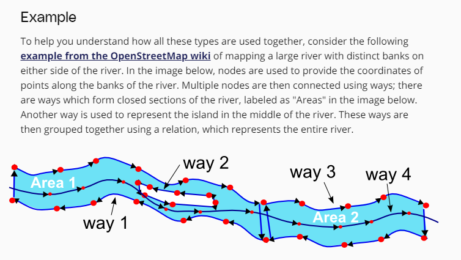

OSM -> open street map

**Building and Running**


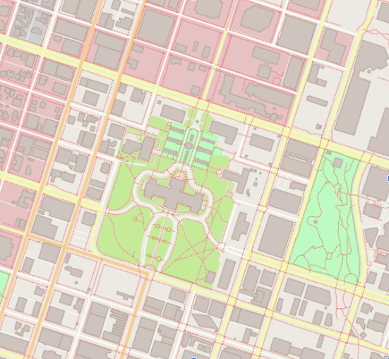

**Testing**


**Project Code Overview**


**Project Starter Repository**


**The src Directory**


**The src Directory Additional Files**


**Steps to Complete the Project**

**Rubric**


## Course 3: Object-Oriented Programming

**System Monitor Project**


**Jupyter Notebooks**


**Struct**


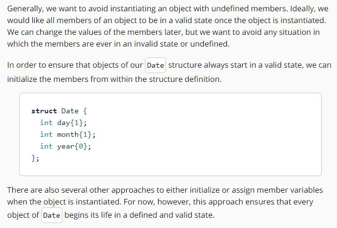

**Access Specifiers**


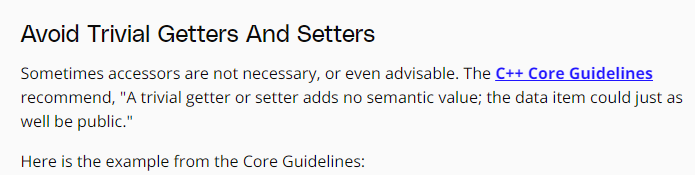
```C++
class Point {
    int x;
    int y;
public:
    Point(int xx, int yy) : x{xx}, y{yy} { }
    int get_x() const { return x; }  // const here promises not to modify the object
    void set_x(int xx) { x = xx; }
    int get_y() const { return y; }  // const here promises not to modify the object
    void set_y(int yy) { y = yy; }
    // no behavioral member functions
};
```

```C++
struct Point {   // Good: concise
    int x {0};   // public member variable with a default initializer of 0
    int y {0};   // public member variable with a default initializer of 0
};
```

**Classes**


```C++
#include <iostream>
#include <cassert>

class Date {
 public:
  int Day() { return day; }
  void Day(int d) {
    if (d >= 1 && d <= 31) day = d;
  }
    int Month() { return month; }
    void Month(int m) {
        if(m >= 1 && m <= 12)
            month = m;
    }
    int Year() { return year; }
    void Year(int y) {
        year = y;
    }

 private:
  int day{1};
  int month{1};
  int year{0};
};

// Test in main
int main()
{
    Date date;
    date.Day(-1);
    date.Month(14);
    date.Year(2000);
    assert(date.Day() != -1);
    assert(date.Month() != 14);
    assert(date.Year() == 2000);
    std::cout << date.Day() << "/" << date.Month() << "/" << date.Year() << "\n";
}
```

**Constructors**


**Scope Resolution**


```C++
Person::move(); \\ Call the move function that is a member of the Person class.
std::map m;     \\ Initialize the map container from the C++ Standard Library.  
```

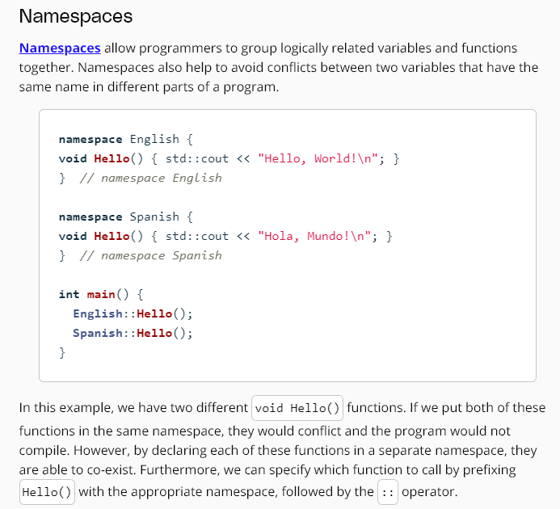

```C++
#include <cassert>

class Date {
 public:
  int Day() { return day; }
  void Day(int day);
  int Month() { return month; }
  void Month(int month);
  int Year() { return year; }
  void Year(int year);

 private:
  int day{1};
  int month{1};
  int year{0};
};

// TODO: Define Date::Day(int day)
void Date::Day(int day) {
    if(day >= 1 && day <= 31)
        Date::day = day;
}

// TODO: Define Date::Month(int month)
void Date::Month(int month) {
    if(month >= 1 && month <= 12)
        Date::month = month;
}

// TODO: Define Date::Year(int year)
void Date::Year(int year) { Date::year = year; }

// Test in main
int main() {
  Date date;
  date.Day(29);
  date.Month(8);
  date.Year(1981);
  assert(date.Day() == 29);
  assert(date.Month() == 8);
  assert(date.Year() == 1981);
}
```
**Initializer Lists**


```C++
#include <assert.h>
#include <string>

// TODO: Define class Person
struct Person {
  // TODO: Define a public constructor with an initialization list
  Person(std::string name) : name(name) {}
  // TODO: Define a public member variable: name
  std::string name;  
};

// Test
int main() {
  Person alice("Alice");
  Person bob("Bob");
  assert(alice.name != bob.name);
}
```


**Initializing Constant Members**
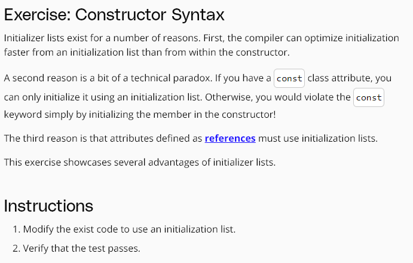
```C++
#include <assert.h>
#include <string>

struct Person {
public:
  // TODO: Add an initialization list
  Person(std::string const & n) : name(n) {}
  std::string const name;
};

// Test
int main() {
  Person alice("Alice");
  Person bob("Bob");
  assert(alice.name != bob.name);
}
```
**Encapsulation**

```C++
#include <cassert>

class Date {
public:
  Date(int day, int month, int year);
  int Day() const { return day_; }
  void Day(int day);
  int Month() const { return month_; }
  void Month(int month);
  int Year() const { return year_; }
  void Year(int year);

private:
  bool LeapYear(int year) const;
  int DaysInMonth(int month, int year) const;
  int day_{1};
  int month_{1};
  int year_{0};
};

Date::Date(int day, int month, int year) {
  Year(year);
  Month(month);
  Day(day);
}

bool Date::LeapYear(int year) const {
    if(year % 4 != 0)
        return false;
    else if(year % 100 != 0)
        return true;
    else if(year % 400 != 0)
        return false;
    else
        return true;
}

int Date::DaysInMonth(int month, int year) const {
    if(month == 2)
        return LeapYear(year) ? 29 : 28;
    else if(month == 4 || month == 6 || month == 9 || month == 11)
        return 30;
    else
        return 31;
}

void Date::Day(int day) {
  if (day >= 1 && day <= DaysInMonth(Month(), Year()))
    day_ = day;
}

void Date::Month(int month) {
  if (month >= 1 && month <= 12)
    month_ = month;
}

void Date::Year(int year) { year_ = year; }

// Test
int main() {
  Date date(29, 2, 2016);
  assert(date.Day() == 29);
  assert(date.Month() == 2);
  assert(date.Year() == 2016);
    
  Date date2(29, 2, 2019);
  assert(date2.Day() != 29);
  assert(date2.Month() == 2);
  assert(date2.Year() == 2019);
}
```
**Accessor Functions**
```C++
#include <iostream>
#include <string>

class BankAccount
{
  protected:
    int number;
    std::string owner;
    double funds;
    
  public:
    // getter functions
    int get_number(){return number;}
    std::string get_owner(){return owner;}
    double get_funds(){return funds;}
    
    // setter functions
    void set_number(int number){ this->number = number;}
    void set_owner(std::string owner){ this->owner = owner;}
    void set_funds(double funds){ this->funds = funds;}
    
    
};

int main(){
    // TODO: instantiate and output a bank account
    BankAccount account;
    account.set_number(123456789);
    account.set_owner("David Silver");
    account.set_funds(1000000.01);
        
    std::cout << "Account Information\n";
    std::cout << "-------------------\n";
    std::cout << "ID: " << account.get_number() << "\n";
    std::cout << "Owner: " << account.get_owner() << "\n";
    std::cout << "Funds: $" << account.get_funds() << "\n";
}
```


**Mutator Functions**


```C++
#include <string>
#include <cstring>
#include <iostream>

class Car {
    // TODO: Declare private attributes
    private:
        std::string _brand;
        
    // TODO: Declare getter and setter for brand
    public:
        void brand(char*);
        std::string brand() const;
        
};

// Define setters
void Car::brand(char* brand)
{
    Car::_brand = brand;
}

// Define getters
std::string Car::brand() const
{
    return _brand;
}

// Test in main()
int main() 
{
    Car car;
    char brand[] = "Peugeot";
    car.brand(brand);
    std::cout << car.brand() << "\n";   
}
```
**Exercise: Pyramid Class**


```C++
#include <cassert>
#include <stdexcept>

// TODO: Define class Pyramid
class Pyramid {
 public:
  // constructor
  Pyramid(int length, int width, int height)
      : length_(length), width_(width), height_(height) {
    Validate();
  }

  // accessors
  int Length() const { return length_; }
  int Width() const { return width_; }
  int Height() const { return height_; }

  // mutators
  void Length(int length) {
    length_ = length;
    Validate();
  }
  void Width(int width) {
    width_ = width;
    Validate();
  }
  void Height(int height) {
    height_ = height;
    Validate();
  }

  // public Volume() function
  float Volume() const { return Length() * Width() * Height() / 3.0; }

  // private class members
 private:
  int length_;
  int width_;
  int height_;
  void Validate() {
    if (length_ <= 0 || width_ <= 0 || height_ <= 0)
      throw std::invalid_argument("negative dimension");
  }
};

// Test
int main() {
  Pyramid pyramid(4, 5, 6);
  assert(pyramid.Length() == 4);
  assert(pyramid.Width() == 5);
  assert(pyramid.Height() == 6);
  assert(pyramid.Volume() == 40);

  bool caught{false};
  try {
    Pyramid invalid(-1, 2, 3);
  } catch (...) {
    caught = true;
  }
  assert(caught);
}
```
**Exercise: Student Class**


```C++
#include <cassert>
#include <stdexcept>
#include <string>

using std::string;

// TODO: Define "Student" class
class Student {
 public:
  // constructor
  Student(string name, int grade, float gpa) : name_(name), grade_(grade), gpa_(gpa) {
      Validate();
  }
  // accessors
  string Name() const {
      return name_;
  }
  int Grade() const {
      return grade_;
  }
  float GPA() const {
      return gpa_;
  }
    
  // mutators
  void Name(string name) {
      name_ = name;
      Validate();
  }
  void Grade(int grade) {
      grade_ = grade;
      Validate();
  }
  void GPA(float gpa) {
      gpa_ = gpa;
      Validate();
  }

 private:
 string name_;
 int grade_;
 float gpa_;
 void Validate() {
     if(Grade() < 0 || Grade() > 12 || GPA() < 0.0 || GPA() > 4.0)
         throw std::invalid_argument("argument out of bounds");
 }
};

// TODO: Test
int main() {
    Student david("David Silver", 10, 4.0);
    assert(david.Name() == "David Silver");
    assert(david.Grade() == 10);
    assert(david.GPA() == 4.0);
    
    bool caught{false};
    try {
        david.Grade(20);
    }
    catch(...) {
        caught = true;
    }
    assert(caught);
}
```


**Abstraction**

```C++
#include <cassert>
#include <string>
#include <vector>

class Date {
 public:
  Date(int day, int month, int year);
  int Day() const { return day_; }
  void Day(int day);
  int Month() const { return month_; }
  void Month(int month);
  int Year() const { return year_; }
  void Year(int year);
  std::string String() const;

 private:
  bool LeapYear(int year) const;
  int DaysInMonth(int month, int year) const;
  int day_{1};
  int month_{1};
  int year_{0};
};

Date::Date(int day, int month, int year) {
  Year(year);
  Month(month);
  Day(day);
}

bool Date::LeapYear(int year) const {
  if (year % 4 != 0)
    return false;
  else if (year % 100 != 0)
    return true;
  else if (year % 400 != 0)
    return false;
  else
    return true;
}

int Date::DaysInMonth(int month, int year) const {
  if (month == 2)
    return LeapYear(year) ? 29 : 28;
  else if (month == 4 || month == 6 || month == 9 || month == 11)
    return 30;
  else
    return 31;
}

void Date::Day(int day) {
  if (day >= 1 && day <= DaysInMonth(Month(), Year())) day_ = day;
}

void Date::Month(int month) {
  if (month >= 1 && month <= 12) month_ = month;
}

void Date::Year(int year) {
  year_ = year;
}


std::string Date::String() const {
  std::vector<std::string> months{"January", "February", "March", "April", "May", "June", "July", "August", "September", "October", "November", "December"};
  return months[Month()-1] + " " + std::to_string(Day()) + ", " + std::to_string(Year());
}

// Test
int main() {
  Date date(29, 8, 1981);
  assert(date.String() == "August 29, 1981");
}
```
**Exercise: Sphere Class**

```C++
#include <cassert>
#include <cmath>
#include <stdexcept>

// TODO: Define class Sphere
class Sphere {
 public:
  // Constructor
  Sphere(int radius) : radius_(radius), volume_(pi_ * 4/3 * pow(radius_,3)) {
      if(radius <= 0) throw std::invalid_argument("radius must be positive");
  }

  // Accessors
  int Radius() const { return radius_; }
  int Volume() const { return volume_; }

 private:
  // Private members
  float const pi_{3.14159};
  int const radius_;
  float const volume_;
};

// Test
int main(void) {
  Sphere sphere(5);
  assert(sphere.Radius() == 5);
  assert(abs(sphere.Volume() - 523.6) < 1);
}
```
**Exercise: Private Method**

```C++
#include <cassert>
#include <cmath>
#include <stdexcept>

class Sphere {
 public:
  Sphere(int radius) : radius_(radius), volume_(pi_ * 4 / 3 * pow(radius_, 3)) {
    if (radius <= 0) throw std::invalid_argument("radius must be positive");
  }

  int Radius() const { return radius_; }
  int Volume() const { return volume_; }

  // TODO: mutator
  void Radius(int radius) {
    if (radius <= 0) throw std::invalid_argument("radius must be positive");
    radius_ = radius;
    volume_ = pi_ * 4 / 3 * pow(radius_, 3);
  }

 private:
  float const pi_{3.14159};
  int radius_;
  float volume_;
};

// Test
int main(void) {
  Sphere sphere(5);
  assert(sphere.Radius() == 5);
  assert(abs(sphere.Volume() - 523.6) < 1);

  sphere.Radius(3);
  assert(sphere.Radius() == 3);
  assert(abs(sphere.Volume() - 113.1) < 1);

  bool caught{false};
  try {
    sphere.Radius(-1);
  } catch (...) {
    caught = true;
  }
  assert(caught);
}
```
**Exercise: Static Members**


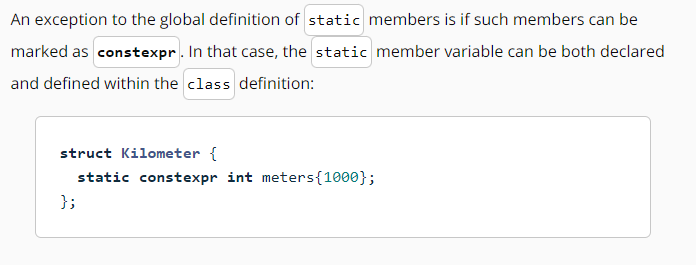

```C++
#include <cassert>
#include <cmath>
#include <stdexcept>

class Sphere {
 public:
  Sphere(int radius) : radius_(radius), volume_(pi_ * 4 / 3 * pow(radius_, 3)) {
    if (radius <= 0) throw std::invalid_argument("radius must be positive");
  }

  int Radius() const { return radius_; }
  int Volume() const { return volume_; }

  // TODO: mutator
  void Radius(int radius) {
    if (radius <= 0) throw std::invalid_argument("radius must be positive");
    radius_ = radius;
    volume_ = pi_ * 4 / 3 * pow(radius_, 3);
  }

 private:
  static float constexpr pi_{3.14159};
  int radius_;
  float volume_;
};

// Test
int main(void) {
  Sphere sphere(5);
  assert(sphere.Radius() == 5);
  assert(abs(sphere.Volume() - 523.6) < 1);
    
  sphere.Radius(3);
  assert(sphere.Radius() == 3);
  assert(abs(sphere.Volume() - 113.1) < 1);

  bool caught{false};
  try {
    sphere.Radius(-1);
  } catch (...) {
    caught = true;
  }
  assert(caught);
}
```
**Exercise: Static Methods**

```C++
#include <cassert>
#include <cmath>
#include <stdexcept>

class Sphere {
 public:
   static float Volume(int radius) {
       return pi_ * 4/3 * pow(radius,3);
   }

 private:
  static float constexpr pi_{3.14159};
};

// Test
int main(void) {
  assert(abs(Sphere::Volume(5) - 523.6) < 1);
}
```

**Inheritance**


```C++
class Vehicle {
public:
  int wheels = 0;
  string color = "blue";

  void Print() const
  {
    std::cout << "This " << color << " vehicle has " << wheels << " wheels!\n";
  }
};
```


```C++
#include <iostream>
#include <string>
using std::string;

class Vehicle {
public:
    int wheels = 0;
    string color = "blue";
    string make  = "generic";
    
    void Print() const
    {
        std::cout << "This " << color << " " << make << " vehicle has " << wheels << " wheels!\n";
    }
};

class Car : public Vehicle {
public:
    bool sunroof = false;
};

class Bicycle : public Vehicle {
public:
    bool kickstand = true;
};

class Scooter : public Vehicle {
public:
    bool electric = false;
};

int main() 
{
    Scooter scooter;
    scooter.wheels = 2;
    scooter.Print();
};
```
**Access Specifiers**


```C++
// This example demonstrates the privacy levels
// between parent and child classes
#include <iostream>
#include <string>
using std::string;

class Vehicle {
public:
    int wheels = 0;
    string color = "blue";
    
    void Print() const
    {
        std::cout << "This " << color << " vehicle has " << wheels << " wheels!\n";
    }
};

class Car : public Vehicle {
public:
    bool sunroof = false;
};

class Bicycle : protected Vehicle {
public:
    bool kickstand = true;
    void Wheels(int w)
    {
        wheels = w;
    }
};

class Scooter : private Vehicle {
public:
    bool electric = false;
    void Wheels(int w)
    {
        wheels = w;
    }
};

int main() 
{
    Car car;
    car.wheels = 4;
    Bicycle bicycle;
    bicycle.Wheels(2);
    Scooter scooter;
    scooter.Wheels(1);
};
```
**Exercise: Animal Class**

```C++
// Example solution for Animal class
#include <iostream>
#include <string>

// Define base class Animal
class Animal {
public:
    std::string color;
    std::string name;
    int age;
};

// Declare derived class Snake
class Snake : public Animal {
public:
    int length;
    
    void MakeSound() const
    {
        std::cout << "Hiss\n";
    }
};

// Declare derived class Cat
class Cat : public Animal {
public:
    int height;

    void MakeSound() const
    {
        std::cout << "Meow\n";
    }
};

// Test in main()
int main() {

    Cat cat;
    Snake snake;

    cat.age = 10;
    cat.name = "Lucy";
    cat.MakeSound();
    snake.MakeSound();

    std::cout << cat.age << " " << cat.name << "\n";
}
```
**Composition**


```C++
// Example solution for Circle class
#include <iostream>
#include <cmath>
#include <assert.h>
// Define PI
#define PI 3.14159;


// Define LineSegment struct
struct LineSegment {
// Define protected attribute length
public:
    double length;
};

// Define Circle class
class Circle {
public:
    Circle(LineSegment& radius);
    double Area();

private:
    LineSegment& radius_;
};

// Declare Circle class
Circle::Circle(LineSegment& radius) : radius_(radius) {}

double Circle::Area() 
{
    return pow(Circle::radius_.length, 2) * PI;
}

// Test in main()
int main() 
{
    LineSegment radius {3};
    Circle circle(radius);
    assert(int(circle.Area()) == 28);
}
```
**Exercise: Class Hierarchy**

```C++
#include <cassert>

// TODO: Declare Vehicle as the base class
class Vehicle {};

// TODO: Derive Car from Vehicle
class Car : public Vehicle {
public:
    int wheels{4};
};

// TODO: Derive Sedan from Car
class Sedan : public Car {
public:
    bool trunk{true};
    int seats{4};
};

// TODO: Update main to pass the tests
int main() {
  Sedan sedan;
  assert(sedan.trunk == true);
  assert(sedan.seats == 4);
  assert(sedan.wheels == 4);
}
```
**Exercise: Friends**


```C++
// Example solution for Rectangle and Square friend classes
#include <assert.h>

// Declare class Rectangle
class Rectangle;

// Define class Square as friend of Rectangle
class Square {
// Add public constructor to Square, initialize side
public:
    Square(int s) : side(s) {}

private:
    // Add friend class Rectangle
    friend class Rectangle;
    // Add private attribute side to Square
    int side;
};

// Define class Rectangle
class Rectangle {
// Add public functions to Rectangle: area() and convert()
public:
    Rectangle(const Square& a);
    int Area() const;

private:
    // Add private attributes width, height
    int width {0};
    int height {0};
};

// Define a Rectangle constructor that takes a Square
Rectangle::Rectangle(const Square& a) : width(a.side), height(a.side) {}

// Define Area() to compute area of Rectangle
int Rectangle::Area() const
{
    return width * height;
}

// Update main() to pass the tests
int main()
{
    Square square(4);
    Rectangle rectangle(square);
    assert(rectangle.Area() == 16); 
}
```
**Polymorphism: Overloading**


```C++
#include <ctime>

class Date {
public:
    Date(int day, int month, int year) : day_(day), month_(month), year_(year) {}
    Date(int day, int month) : day_(day), month_(month)  // automatically sets the Date to the current year
    {
        time_t t = time(NULL);
	    tm* timePtr = localtime(&t);
        year_ = timePtr->tm_year;
    }

private:
    int day_;
    int month_;
    int year_;
};
```

```C++
#include <iostream>

class Human {};
class Dog {};
class Cat {};

// TODO: Write hello() function
void hello() { std::cout << "Hello, World!\n"; }

// TODO: Overload hello() three times
void hello(Human human) { std::cout << "Hello, Human!\n"; }
void hello(Dog dog) { std::cout << "Hello, Dog!\n"; }
void hello(Cat cat) { std::cout << "Hello, Cat!\n"; }

// TODO: Call hello() from main()
int main()
{
    hello();
    hello(Human());
    hello(Dog());
    hello(Cat());
}
```
**Polymorphism: Operator Overloading**


```C++
#include <assert.h>

// TODO: Define Point class
class Point {
public:
  // TODO: Define public constructor
  Point(int x = 0, int y = 0) : x(x), y(y) {}

  // TODO: Define + operator overload
  Point operator+(const Point& addend) {
    Point sum;
    sum.x = x + addend.x;
    sum.y = y + addend.y;
    return sum;
  }

  // TODO: Declare attributes x and y
  int x, y;
};

// Test in main()
int main() {
  Point p1(10, 5), p2(2, 4);
  Point p3 = p1 + p2; // An example call to "operator +";
  assert(p3.x == p1.x + p2.x);
  assert(p3.y == p1.y + p2.y);
}
```
**Virtual Functions**


```C++
// Example solution for Shape inheritance
#include <assert.h>
#include <cmath>

// TODO: Define pi
#define PI 3.14159;

// TODO: Define the abstract class Shape
class Shape {
public:
  // Define public virtual functions Area() and Perimeter()
  // Append the declarations with = 0 to specify pure virtual functions
  virtual double Area() const = 0;
  virtual double Perimeter() const = 0;
};

// TODO: Define Rectangle to inherit publicly from Shape
class Rectangle : public Shape {
public:
  // TODO: Declare public constructor
  Rectangle(double w, double h) {
    Rectangle::width_ = w;
    Rectangle::height_ = h;
  }
  // TODO: Override virtual base class functions Area() and Perimeter()
  double Area() const override { return width_ * height_; }
  double Perimeter() const override { return 2 * (width_ + height_); }

private:
  // TODO: Declare private attributes width and height
  double width_;
  double height_;
};

// TODO: Define Circle to inherit from Shape
class Circle : public Shape {
public:
  // TODO: Declare public constructor
  Circle(double r) { radius_ = r; }
  // TODO: Override virtual base class functions Area() and Perimeter()
  double Area() const override { return pow(radius_, 2) * PI; }
  double Perimeter() const override { return 2 * radius_ * PI; }

private:
  // TODO: Declare private member variable radius
  double radius_;
};

// Test in main()
int main() {
  double epsilon = 0.1; // useful for floating point equality

  // Test circle
  Circle circle(12.31);
  assert(abs(circle.Perimeter() - 77.35) < epsilon);
  assert(abs(circle.Area() - 476.06) < epsilon);

  // Test rectangle
  Rectangle rectangle(10, 6);
  assert(rectangle.Perimeter() == 32);
  assert(rectangle.Area() == 60);
}
```
**Polymorphism: Overriding**


```C++
#include <assert.h>
#include <string>

class Animal {
public:
  virtual std::string Talk() const = 0;
};

// TODO: Declare a class Dog that inherits from Animal
class Dog : Animal {
public:  
    std::string Talk() const;
};

std::string Dog::Talk() const {
    return "Woof";
}

int main() {
  Dog dog;
  assert(dog.Talk() == "Woof");
}
```

**Override**


```C++
#include <assert.h>
#include <cmath>

// TODO: Define PI
#define PI 3.14159

// TODO: Declare abstract class VehicleModel
class VehicleModel {
  // TODO: Declare virtual function Move()
  virtual void Move(double v, double phi) = 0;
};

// TODO: Derive class ParticleModel from VehicleModel
class ParticleModel : public VehicleModel {
public:
  // TODO: Override the Move() function
  void Move(double v, double phi) override {
    theta += phi;
    x += v * cos(theta);
    y += v * sin(theta);
  }
  // TODO: Define x, y, and theta
  double x = 0;
  double y = 0;
  double theta = 0;
};

// TODO: Derive class BicycleModel from ParticleModel
class BicycleModel : public ParticleModel {
public:
  // TODO: Override the Move() function
  void Move(double v, double phi) override {
    theta += v / L * tan(phi);
    x += v * cos(theta);
    y += v * sin(theta);
  }
  // TODO: Define L
  double L = 1;
};

// TODO: Pass the tests
int main() {
  // Test function overriding
  ParticleModel particle;
  BicycleModel bicycle;
  particle.Move(10, PI / 9);
  bicycle.Move(10, PI / 9);
  assert(particle.x != bicycle.x);
  assert(particle.y != bicycle.y);
  assert(particle.theta != bicycle.theta);
}
```
**Multiple Inheritance**


```C++
#include <iostream>
#include <string>
#include <assert.h>

class Animal {
public:
    double age;
};

class Pet {
public:
    std::string name;
};

// Dog derives from *both* Animal and Pet
class Dog : public Animal, public Pet {
public:
    std::string breed;
};

class Cat : public Animal, public Pet {
public:
    std::string color;
};

int main()
{
    /*
    Cat cat;
    cat.color = "black";
    cat.age = 10;
    cat.name = "Max";
    */
    assert(cat.color == "black");
    assert(cat.age == 10);
    assert(cat.name == "Max");
}
```

**Templates**
Được gọi là generic programming

**Exercise: Comparison Operation**

```C++
#include <assert.h>

// TODO: Declare a generic, templatized function Max()
template <typename T> T Max(T a, T b) {
    return a > b ? a : b;
}

int main() { 
  assert(Max(10, 50) == 50);
  assert(Max(5.7, 1.436246) == 5.7);
}
```
**Deduction**


```C++
#include <assert.h>

// TODO: Declare a generic, templatized average function
template <typename T> T average(T a, T b) { return (a+b)/2; }

int main() { assert(average(2.0,5.0) == 3.5); }
```
**Exercise: Class Template**
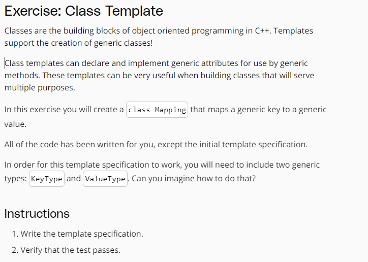
```C++
#include <assert.h>
#include <string>
#include <sstream>

// TODO: Add the correct template specification
template <typename KeyType, typename ValueType>
class Mapping {
public:
  Mapping(KeyType key, ValueType value) : key(key), value(value) {}
  std::string Print() const {
    std::ostringstream stream;
    stream << key << ": " << value;
    return stream.str();
  }
  KeyType key;
  ValueType value;
};

// Test
int main() {
  Mapping<std::string, int> mapping("age", 20);
  assert(mapping.Print() == "age: 20");
}
```
**Project 2**

**System Data**


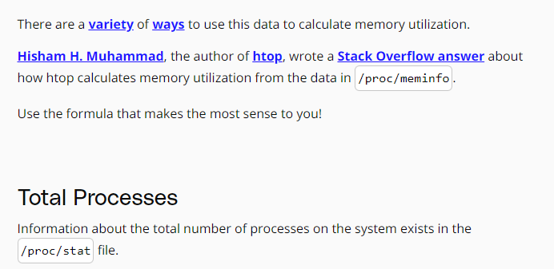


**Processor Data**


**Process Data**


**Project Workspace**

```C++
git clone https://github.com/udacity/CppND-System-Monitor-Project-Updated
```
**Project: Process Monitor**


## Course 4: Memory management
**Course Overview**


**Using the Debugger to Analyze Memory**


**Types of Computer Memory**


**Cache Memory**


```C++
#include <chrono>
#include <iostream>

int main()
{
    // create array 
    const int size = 4;
    static int x[size][size];

    auto t1 = std::chrono::high_resolution_clock::now();
    for (int i = 0; i < size; i++)
    {
        for (int j = 0; j < size; j++)
        {
            x[j][i] = i + j;
            std::cout << &x[j][i] << ": i=" << i << ", j=" << j << std::endl;
        }
    }

    // print execution time to console
    auto t2 = std::chrono::high_resolution_clock::now(); // stop time measurement
    auto duration = std::chrono::duration_cast<std::chrono::microseconds>(t2 - t1).count();
    std::cout << "Execution time: " << duration << " microseconds" << std::endl;

    return 0;
}
```


**Virtual Memory**


**The Process Memory Model**


**Memory Allocation in C++**


**Automatic Memory Allocation (The Stack)**


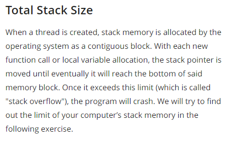


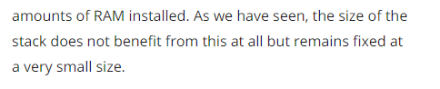


**Call-By-Value vs. Call-By-Reference**

```C++
bool MyLocalFunction(int myInt)
{
	bool isBelowThreshold = myInt < 42 ? true : false;
	return isBelowThreshold;
}

int main()
{
	bool res = MyLocalFunction(23);
	return 0; 
}
```


```C++
#include <iostream>

void AddTwo(int val)
{
    val += 2;
}

int main()
{
    int val = 0;
    AddTwo(val);
    val += 2;

    std::cout << "val = " << val << std::endl;
 
    return 0;
}
```


```C++
#include <iostream>

void AddThree(int *val)
{
    *val += 3;
}

int main()
{
    int val = 0;
    AddThree(&val);
    val += 2;

    std::cout << "val = " << val << std::endl;
 
    return 0;
}
```

```C++
#include <iostream>

void AddFour(int &val)
{
    val += 4;
}

int main()
{
    int val = 0;
    AddFour(val);
    val += 2;

    std::cout << "val = " << val << std::endl;
 
    return 0;
}
```


```C++
#include <stdio.h>
    
void CallByValue(int i)
{
    int j = 1; 
    printf ("call-by-value: %p\n",&j);
}

void CallByPointer(int *i)
{
    int j = 1; 
    printf ("call-by-pointer: %p\n",&j);
}

void CallByReference(int &i)
{
    int j = 1; 
    printf ("call-by-reference: %p\n",&j);
}

int main()
{
    int i = 0;
    printf ("stack bottom: %p\n",&i);
    
    CallByValue(i);

    CallByPointer(&i);

    CallByReference(i);

    return 0;
}
```


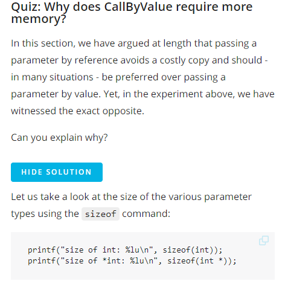


**Heap Memory**


**Using malloc and free**


```C++
#include <stdio.h> 
#include <stdlib.h> 
  
int main() 
{ 
    void *p = malloc(sizeof(int));
    printf("address=%p, value=%d\n", p, *p);

    return 0; 
}
```


```C++
#include <stdio.h> 
#include <stdlib.h> 
  
int main() 
{ 
    void *p = malloc(sizeof(int));
    printf("address=%p, value=%d\n", p, *p);

    return 0; 
}
```

```C++
#include <stdio.h> 
#include <stdlib.h> 

int main() 
{ 
    // reserve memory for two integers
    int *p = (int*)malloc(2*sizeof(int));
    p[0] = 1; p[1] = 2; 

    // resize memory to hold four integers
    p = (int*)realloc(p,4*sizeof(int));
    p[2] = 3; p[3] = 4; 

    // resize memory again to hold two integers
    p = (int*)realloc(p,2*sizeof(int));

    printf("address=%p, value=%d\n", p+0, *(p+0)); // valid
    printf("address=%p, value=%d\n", p+1, *(p+1)); // valid

    printf("address=%p, value=%d\n", p+2, *(p+2)); // INVALID
    printf("address=%p, value=%d\n", p+3, *(p+3)); // INVALID

    return 0; 
}
```

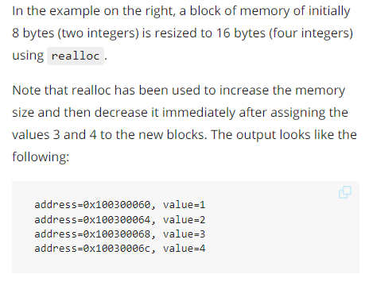

```C++
#include <stdio.h>
#include <stdlib.h>

int main()
{
    void *p = malloc(100); 
    free(p);
    
    void *p2 = p; 
    free(p2);

    return 0;
}
```


**Using new and delete**

```C++
#include <stdlib.h>
#include <iostream>

class MyClass
{
private:
    int *_number;

public:
    MyClass()
    {
        std::cout << "Allocate memory\n";
        _number = (int *)malloc(sizeof(int));
    }
    ~MyClass()
    {
        std::cout << "Delete memory\n";
        free(_number);
    }
    void setNumber(int number)
    {
        *_number = number;
        std::cout << "Number: " << * _number << "\n";
    }
};


int main()
{
    // allocate memory using malloc
    // comment these lines out to run the example below
    MyClass *myClass = (MyClass *)malloc(sizeof(MyClass));
    myClass->setNumber(42); // EXC_BAD_ACCESS
    free(myClass);
	  
	// allocate memory using new
    MyClass *myClass = new MyClass();
    myClass->setNumber(42); // works as expected
    delete myClass;

    return 0;
}
```


```C++
#include <iostream>
#include <stdlib.h>

class MyClass
{
    int _mymember;

public:
    MyClass()
    {
        std::cout << "Constructor is called\n";
    }

    ~MyClass()
    {
        std::cout << "Destructor is called\n";
    }

    void *operator new(size_t size)
    {
        std::cout << "new: Allocating " << size << " bytes of memory" << std::endl;
        void *p = malloc(size);

        return p;
    }

    void operator delete(void *p)
    {
        std::cout << "delete: Memory is freed again " << std::endl;
        free(p);
    }
};

int main()
{
    MyClass *p = new MyClass();
    delete p;
}
```


```C++
#include <iostream>
#include <stdlib.h>

class MyClass
{
    int _mymember;

public:
    MyClass()
    {
        std::cout << "Constructor is called\n";
    }

    ~MyClass()
    {
        std::cout << "Destructor is called\n";
    }

    void *operator new[](size_t size)
    {
        std::cout << "new: Allocating " << size << " bytes of memory" << std::endl;
        void *p = malloc(size);

        return p;
    }

    void operator delete[](void *p)
    {
        std::cout << "delete: Memory is freed again " << std::endl;
        free(p);
    }
};

int main()
{
    MyClass *p = new MyClass[3]();
    delete[] p;
}
```


**Typical Memory Management Problems**


**Debugging memory leaks with Valgrind**

**Copy Semantics**

```C++
#include <iostream>

class MyClass
{
private:
    int *_myInt;

public:
    MyClass()
    {
        _myInt = (int *)malloc(sizeof(int));
    };
    ~MyClass()
    {
        free(_myInt);
    };
    void printOwnAddress() { std::cout << "Own address on the stack is " << this << std::endl; }
    void printMemberAddress() { std::cout << "Managing memory block on the heap at " << _myInt << std::endl; }
};

int main()
{
    // instantiate object 1
    MyClass myClass1;
    myClass1.printOwnAddress();
    myClass1.printMemberAddress();

    // copy object 1 into object 2
    MyClass myClass2(myClass1); // copy constructor
    myClass2.printOwnAddress();
    myClass2.printMemberAddress();

    return 0;
}
```


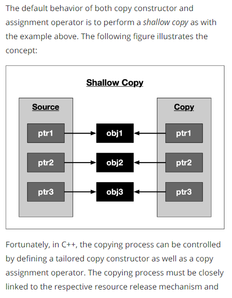
```C++
class NoCopyClass1
{
private:
    NoCopyClass1(const NoCopyClass1 &);
    NoCopyClass1 &operator=(const NoCopyClass1 &);

public:
    NoCopyClass1(){};
};

class NoCopyClass2
{
public:
    NoCopyClass2(){}
    NoCopyClass2(const NoCopyClass2 &) = delete;
    NoCopyClass2 &operator=(const NoCopyClass2 &) = delete;
};

int main()
{
    NoCopyClass1 original1;
    NoCopyClass1 copy1a(original1); // copy c’tor
    NoCopyClass1 copy1b = original1; // assigment operator

    NoCopyClass2 original2;
    NoCopyClass2 copy2a(original2); // copy c’tor
    NoCopyClass2 copy2b = original2; // assigment operator

    return 0;
}
```
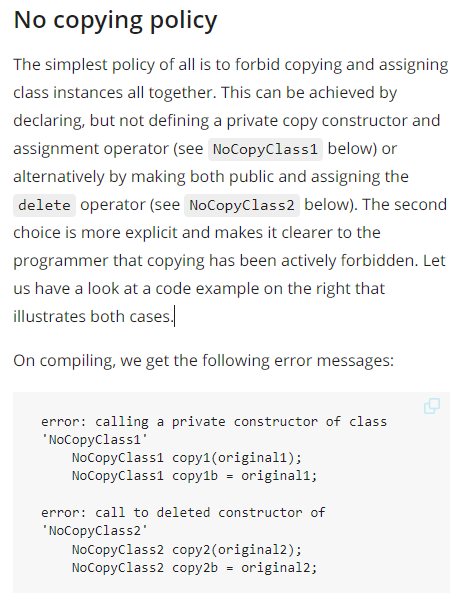

```C++
#include <iostream>

class ExclusiveCopy
{
private:
    int *_myInt;

public:
    ExclusiveCopy()
    {
        _myInt = (int *)malloc(sizeof(int));
        std::cout << "resource allocated" << std::endl;
    }
    ~ExclusiveCopy()
    {
        if (_myInt != nullptr)
        {
            free(_myInt);
            std::cout << "resource freed" << std::endl;
        }
            
    }
    ExclusiveCopy(ExclusiveCopy &source)
    {
        _myInt = source._myInt;
        source._myInt = nullptr;
    }
    ExclusiveCopy &operator=(ExclusiveCopy &source)
    {
        _myInt = source._myInt;
        source._myInt = nullptr;
        return *this;
    }
};

int main()
{
    ExclusiveCopy source;
    ExclusiveCopy destination(source);

    return 0;
}
```


```C++
#include <iostream>

class DeepCopy
{
private:
    int *_myInt;

public:
    DeepCopy(int val)
    {
        _myInt = (int *)malloc(sizeof(int));
        *_myInt = val;
        std::cout << "resource allocated at address " << _myInt << std::endl;
    }
    ~DeepCopy()
    {
        free(_myInt);
        std::cout << "resource freed at address " << _myInt << std::endl;
    }
    DeepCopy(DeepCopy &source)
    {
        _myInt = (int *)malloc(sizeof(int));
        *_myInt = *source._myInt;
        std::cout << "resource allocated at address " << _myInt << " with _myInt = " << *_myInt << std::endl;
    }
    DeepCopy &operator=(DeepCopy &source)
    {
        _myInt = (int *)malloc(sizeof(int));
        std::cout << "resource allocated at address " << _myInt << " with _myInt=" << *_myInt << std::endl;
        *_myInt = *source._myInt;
        return *this;
    }
};

int main()
{
    DeepCopy source(42);
    DeepCopy dest1(source);
    DeepCopy dest2 = dest1;

    return 0;
}

```


```C++
#include <iostream>

class SharedCopy
{
private:
    int *_myInt;
    static int _cnt;

public:
    SharedCopy(int val);
    ~SharedCopy();
    SharedCopy(SharedCopy &source);
};

int SharedCopy::_cnt = 0;

SharedCopy::SharedCopy(int val)
{
    _myInt = (int *)malloc(sizeof(int));
    *_myInt = val;
    ++_cnt;
    std::cout << "resource allocated at address " << _myInt << std::endl;
}

SharedCopy::~SharedCopy()
{
    --_cnt;
    if (_cnt == 0)
    {
        free(_myInt);
        std::cout << "resource freed at address " << _myInt << std::endl;
    }
    else
    {
        std::cout << "instance at address " << this << " goes out of scope with _cnt = " << _cnt << std::endl;
    }
}

SharedCopy::SharedCopy(SharedCopy &source)
{
    _myInt = source._myInt;
    ++_cnt;
    std::cout << _cnt << " instances with handles to address " << _myInt << " with _myInt = " << *_myInt << std::endl;
}

int main()
{
    SharedCopy source(42);
    SharedCopy destination1(source);
    SharedCopy destination2(source);
    SharedCopy destination3(source);

    return 0;
}
```


**Lvalues and Rvalues**
```C++
int main()
{
    // initialize some variables on the stack
    int i, j, *p;

    // correct usage of lvalues and rvalues
    
    i = 42; // i is an lvalue and 42 is an rvalue
    
    p = new int;
    *p = i; // the dereferenced pointer is an lvalue
    delete p; 
    
    ((i < 42) ? i : j) = 23; // the conditional operator returns an lvalue (eiter i or j)

    // incorrect usage of lvalues and rvalues
    //42 = i; // error : the left operand must be an lvalue
    //j * 42 = 23; // error : the left operand must be an lvalue

    return 0; 
}
```

```C++
#include <iostream>

void myFunction(int &val)
{
    ++val;
}

int main()
{
    int i = 1; 
    myFunction(i);

    std::cout << "i = " << i << std::endl;

    return 0;
}
```

```C++
#include <iostream>

void myFunction(int &val)
{
    std::cout << "val = " << val << std::endl;
}

int main()
{
    int j = 42;
    myFunction(j);

    myFunction(42);

    int k = 23; 
    myFunction(j+k);

    return 0; 
}
```

```C++
#include <iostream>

int main()
{
    int i = 1; 
    int j = 2; 
    int k = i + j; 
    int &&l = i + j; 

    std::cout << "k = " << k << ", l = " << l << std::endl;

    return 0; 
}
```


**Move Semantics**
```C++
#include <iostream>

void myFunction(int &&val)
{
    std::cout << "val = " << val << std::endl;
}

int main()
{
    myFunction(42);

    return 0; 
}
```

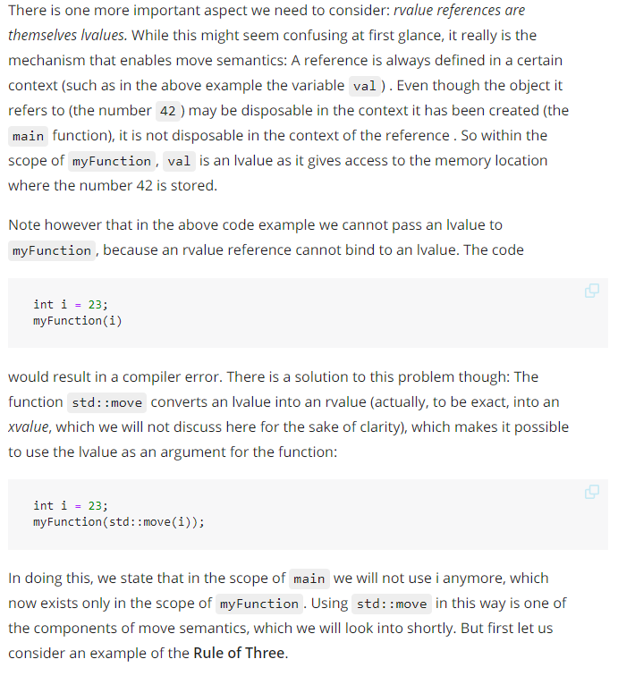
```C++
#include <stdlib.h>
#include <iostream>

class MyMovableClass
{
private:
    int _size;
    int *_data;

public:
    MyMovableClass(size_t size) // constructor
    {
        _size = size;
        _data = new int[_size];
        std::cout << "CREATING instance of MyMovableClass at " << this << " allocated with size = " << _size*sizeof(int)  << " bytes" << std::endl;
    }

    ~MyMovableClass() // 1 : destructor
    {
        std::cout << "DELETING instance of MyMovableClass at " << this << std::endl;
        delete[] _data;
    }
};
```


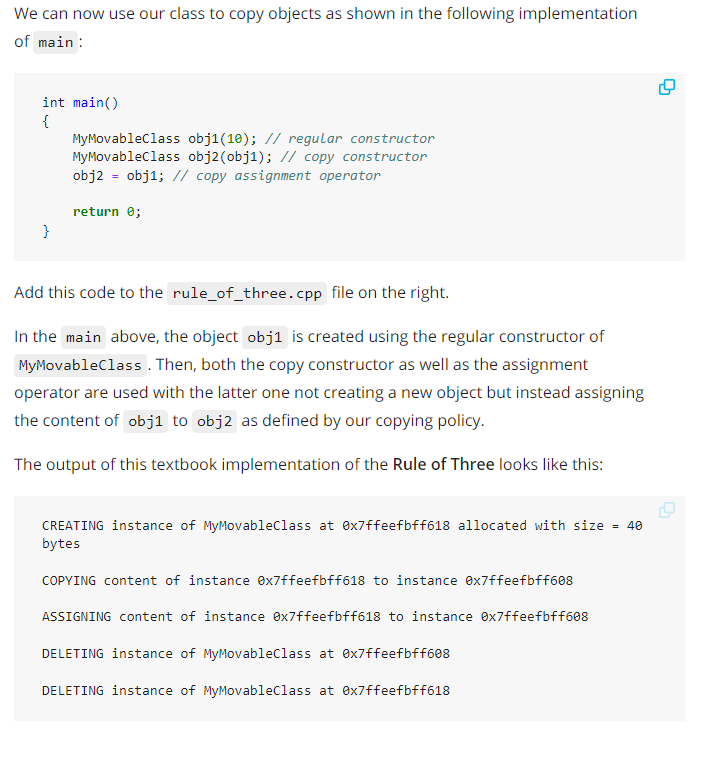


```C++
#include <stdlib.h>
#include <iostream>

class MyMovableClass
{
private:
    int _size;
    int *_data;

public:
    MyMovableClass(size_t size) // constructor
    {
        _size = size;
        _data = new int[_size];
        std::cout << "CREATING instance of MyMovableClass at " << this << " allocated with size = " << _size*sizeof(int)  << " bytes" << std::endl;
    }

    ~MyMovableClass() // 1 : destructor
    {
        std::cout << "DELETING instance of MyMovableClass at " << this << std::endl;
        delete[] _data;
    }
    
    MyMovableClass(const MyMovableClass &source) // 2 : copy constructor
    {
        _size = source._size;
        _data = new int[_size];
        *_data = *source._data;
        std::cout << "COPYING content of instance " << &source << " to instance " << this << std::endl;
    }
    
    MyMovableClass &operator=(const MyMovableClass &source) // 3 : copy assignment operator
    {
        std::cout << "ASSIGNING content of instance " << &source << " to instance " << this << std::endl;
        if (this == &source)
            return *this;
        delete[] _data;
        _data = new int[source._size];
        *_data = *source._data;
        _size = source._size;
        return *this;
    }
};

int main()
{
    MyMovableClass obj1(10); // regular constructor
    MyMovableClass obj2(obj1); // copy constructor
    obj2 = obj1; // copy assignment operator

    return 0;
}
```


**Using Move Semantics**


```C++
/* 
Memory Management exercises part 1: Pass data between functions without using move semantics
*/

#include <iostream>
#include <vector>
#include <cmath>

using namespace std;

// pass back by pointer (old C++)
const int array_size = 1e6; // determines size of the random number array
vector<int> *RandomNumbers1()
{
    vector<int> *random_numbers = new vector<int>(array_size); // allocate memory on the heap...
    for (int i = 0; i < array_size; i++)
    {
        int b = rand();
        (*random_numbers).push_back(b); // ...and fill it with random numbers
    }
    return random_numbers; // return pointer to heap memory
}

// pass back by reference (old C++)
void RandomNumbers2(vector<int> &random_numbers)
{
    random_numbers.resize(array_size); // expand vector to desired size
    for (int i = 0; i < array_size; i++)
    {
        random_numbers[i] = rand();
    }
}

int main()
{
    /* EXERCISE 1-1: Get access to random data using a returned pointer from function RandomNumbers1 and make sure that there are no memory leaks.*/
    // store the data in a suitable variable named 'random_numbers_1' and free the associated memory immediately afterwards

    // SOLUTION to exercise 1-1
    vector<int> *random_numbers_1 = RandomNumbers1(); // return-by-pointer
     delete random_numbers_1;

    /* EXERCISE 1-2: Get access to data using pass-by-reference */
    // store the data in a suitable variable named 'random_numbers_2'

    // SOLUTION to exercise 1-2
    vector<int> random_numbers_2; // create identifier to pass to the function
    RandomNumbers2(random_numbers_2);
}
```

```C++
/* 
Memory Management exercises part 2: Use move semantics implicitly as part of the STL
*/

#include <iostream>
#include <vector>
#include <cmath>

using namespace std;

const int array_size = 1e6;
vector<int> RandomNumbers3()
{
    vector<int> random_numbers;
    random_numbers.resize(array_size);
    for (int i = 0; i < array_size; i++)
    {
        random_numbers[i] = rand();
    }
    return random_numbers; // return-by-value of the STL vector
}

int main()
{
    /* EXERCISE 2-1: Return large objects using move semantics in the STL */
    // store the data in a suitable variable named 'random_numbers_3'

    // SOLUTION to exercise 2-1
    vector<int> random_numbers_3 = RandomNumbers3(); // will not copy the vector but use move semantics "under the hood"
                                                     // Note that all of the STL classes (including vector) have been extended to support move semantics
}
```

```C++
#include <iostream>

using namespace std;

// This class for managing a template-based heap ressource implements move semantics
template <class T>
class MyClass
{
    T *data = nullptr;

public:
    MyClass() {}

    // move constructor
    MyClass(MyClass &&other)
    {
        data = other.data;
        other.data = nullptr;
    }

    // move assignment operator
    MyClass &operator=(MyClass &&other)
    {
        if (this != &other)
        {
            if (data)
            {
                delete data;
            }
            data = other.data;
            other.data = nullptr;
        }

        return *this;
    }

    // copy constructor
    MyClass(const MyClass &);

    // copy assignment operator
    MyClass &operator=(const MyClass &);

    ~MyClass()
    {
        if (data)
        {
            delete data;
        }
    }
};

int main()
{
    /* EXERCISE 3-1: create an instance h1 of class MyClass with data of type 'double' using the regular constructor */
    // SOLUTION 3-1
    MyClass<double> h1; // regular constructor

    // /* EXERCISE 3-2: create an instance h2 of class MyClass using the move constructor (moving from h1) */
    // // SOLUTION 3-2
    MyClass<double> h3 = move(h1); // move constructor (rvalue as input)

    /* EXERCISE 3-3: disable copying for class MyClass */
    // SOLUTION 3-3
    // set visibility of MyClass(const MyClass &) and of MyClass &operator=(const MyClass &) to private
}
```
**Resource Acquisition is Initialization RAII**


```C++
int main()
{
    double den[] = {1.0, 2.0, 3.0, 4.0, 5.0};
    for (size_t i = 0; i < 5; ++i)
    {
        // allocate the resource on the heap
        double *en = new double(i);

        // use the resource
        std::cout << *en << "/" << den[i] << " = " << *en / den[i] << std::endl;

        // deallocate the resource
        delete en;
    }

    return 0;
}
```


**Smart Pointers**


```C++
#include <memory>

void RawPointer()
{
    int *raw = new int; // create a raw pointer on the heap
    *raw = 1; // assign a value
    delete raw; // delete the resource again
}

void UniquePointer()
{
    std::unique_ptr<int> unique(new int); // create a unique pointer on the stack
    *unique = 2; // assign a value
    // delete is not neccessary
}
```

```C++
#include <iostream>
#include <memory>
#include <string>

class MyClass
{
private:
    std::string _text;

public:
    MyClass() {}
    MyClass(std::string text) { _text = text; }
    ~MyClass() { std::cout << _text << " destroyed" << std::endl; }
    void setText(std::string text) { _text = text; }
};

int main()
{
    // create unique pointer to proprietary class
    std::unique_ptr<MyClass> myClass1(new MyClass());
    std::unique_ptr<MyClass> myClass2(new MyClass("String 2"));

    // call member function using ->
    myClass1->setText("String 1");

    // use the dereference operator * 
    *myClass1 = *myClass2;

    // use the .get() function to retrieve a raw pointer to the object
    std::cout << "Objects have stack addresses " << myClass1.get() << " and " << myClass2.get() << std::endl;

    return 0;
}
```


```C++
#include <iostream>
#include <memory>

int main()
{
    std::shared_ptr<int> shared1(new int);
    std::cout << "shared pointer count = " << shared1.use_count() << std::endl;

    {
        std::shared_ptr<int> shared2 = shared1;
        std::cout << "shared pointer count = " << shared1.use_count() << std::endl;
    }
    
    std::cout << "shared pointer count = " << shared1.use_count() << std::endl;

    return 0;
}
```


```C++
#include <iostream>
#include <memory>

class MyClass
{
public:
    ~MyClass() { std::cout << "Destructor of MyClass called" << std::endl; }
};

int main()
{
    std::shared_ptr<MyClass> shared(new MyClass);
    std::cout << "shared pointer count = " << shared.use_count() << std::endl;

    shared.reset(new MyClass);
    std::cout << "shared pointer count = " << shared.use_count() << std::endl;

    return 0;
}
```

```C++
#include <iostream>
#include <memory>

class MyClass
{
public:
    std::shared_ptr<MyClass> _member;
    ~MyClass() { std::cout << "Destructor of MyClass called" << std::endl; }
};

int main()
{
    std::shared_ptr<MyClass> myClass1(new MyClass);
    std::shared_ptr<MyClass> myClass2(new MyClass);

    return 0;
}
```

```C++
#include <iostream>
#include <memory>

int main()
{
    std::shared_ptr<int> mySharedPtr(new int);
    std::cout << "shared pointer count = " << mySharedPtr.use_count() << std::endl;

    std::weak_ptr<int> myWeakPtr1(mySharedPtr);
    std::weak_ptr<int> myWeakPtr2(myWeakPtr1);
    std::cout << "shared pointer count = " << mySharedPtr.use_count() << std::endl;

    // std::weak_ptr<int> myWeakPtr3(new int); // COMPILE ERROR

    return 0;
}
```

```C++
#include <iostream>
#include <memory>

int main()
{
    std::shared_ptr<int> mySharedPtr(new int);
    std::weak_ptr<int> myWeakPtr(mySharedPtr);

    mySharedPtr.reset(new int);

    if (myWeakPtr.expired() == true)
    {
        std::cout << "Weak pointer expired!" << std::endl;
    }

    return 0;
}
```

```C++
#include <iostream>
#include <memory>

int main()
{
    // construct a unique pointer
    std::unique_ptr<int> uniquePtr(new int);
    
    // (1) shared pointer from unique pointer
    std::shared_ptr<int> sharedPtr1 = std::move(uniquePtr);

    // (2) shared pointer from weak pointer
    std::weak_ptr<int> weakPtr(sharedPtr1);
    std::shared_ptr<int> sharedPtr2 = weakPtr.lock();

    // (3) raw pointer from shared (or unique) pointer   
    int *rawPtr = sharedPtr2.get();
    delete rawPtr;

    return 0;
}
```


**Transferring Ownership**


```C++
#include <iostream>
#include <memory>

class MyClass
{
private:
    int _member;

public:
    MyClass(int val) : _member{val} {}
    void printVal() { std::cout << ", managed object " << this << " with val = " << _member << std::endl; }
};

void f(std::unique_ptr<MyClass> ptr)
{
    std::cout << "unique_ptr " << &ptr;
    ptr->printVal();
}

int main()
{
    std::unique_ptr<MyClass> uniquePtr = std::make_unique<MyClass>(23);
    std::cout << "unique_ptr " << &uniquePtr;
    uniquePtr->printVal();

    f(std::move(uniquePtr));

    if (uniquePtr)
        uniquePtr->printVal();

    return 0;
}
```

```C++
#include <iostream>
#include <memory>
class MyClass
{
private:
    int _member;

public:
    MyClass(int val) : _member{val} {}
    void printVal() { std::cout << ", managed object " << this << " with val = " << _member << std::endl; }
};

void f(std::unique_ptr<MyClass> ptr)
{
    std::cout << "unique_ptr " << &ptr;
    ptr->printVal();
}


void f(std::shared_ptr<MyClass> ptr)
{
    std::cout << "shared_ptr (ref_cnt= " << ptr.use_count() << ") " << &ptr;
    ptr->printVal();
}

int main()
{
    std::shared_ptr<MyClass> sharedPtr = std::make_shared<MyClass>(23);
    std::cout << "shared_ptr (ref_cnt= " << sharedPtr.use_count() << ") " << &sharedPtr;
    sharedPtr->printVal();

    f(sharedPtr);

    std::cout << "shared_ptr (ref_cnt= " << sharedPtr.use_count() << ") " << &sharedPtr;
    sharedPtr->printVal();

    return 0;
}
```


**Practice Smart Pointers**

```C++
/* 
Smart pointer exercises: Handling unique, shared and smart pointers

// If all tasks are solved properly, the following text should appear in the terminal
Learn Coding with Udacity!
weak pointer is expired

Note: Compile with C++17
*/


#include <string>
#include <iostream>
#include <memory>

void f1(std::unique_ptr<std::string> unique_ptr)
{
    // TASK 3: Print the content of unique_ptr to the terminal
    // SOLUTION 3: 
    std::cout << *unique_ptr;
}

void f2(std::shared_ptr<std::string> shared_ptr)
{
    // TASK 4: Print the use count property of shared_ptr to the terminal to see how many pointers refer to its resource
    //         If the use count is 2, print the content of shared_ptr to the terminal
    // SOLUTION 4:
    if(shared_ptr.use_count()==2) 
        std::cout << *shared_ptr;
}

void f3(std::weak_ptr<std::string> weak_ptr)
{
    // TASK 5: Lock the weak pointer by assigning it to a shared pointer. Then, print its content to the terminal.
    //        If the weak ptr can not be locked because the resource it refers to has expired, print the string "weak pointer is expired" to the terminal.
    // SOLUTION 5:
    if (auto shared_ptr = weak_ptr.lock()) // // Copy into a shared_ptr to use it
    {
        std::cout << *shared_ptr << "\n";
    }
    else
    {
        std::cout << "weak pointer is expired\n";
    }
}

int main()
{
    // create resources to move around
    auto unique_str = std::make_unique<std::string>("Learn ");
    auto shared_str_1 = std::make_shared<std::string>("Coding ");
    auto shared_str_2 = std::make_shared<std::string>("with Udacity!");

    // Moving a unique pointer to transfer ownership
    // TASK 1 : pass the pointer 'unique_str' into the function f1 
    // SOLUTION 1: 
    f1(std::move(unique_str));

    // Pass a shared pointer by value
    // TASK 2 : pass the pointer 'shared_str_1' into the function f2 
    // SOLUTION 2:
    f2(shared_str_1);

    // Pass a weak ptr by value and create a shared ptr from it to use it
    std::weak_ptr<std::string> weak_ptr_1;
    weak_ptr_1 = shared_str_2;
    f3(weak_ptr_1);

    // Pass a weak ptr by value after the shared ptr has expired
    std::weak_ptr<std::string> weak_ptr_2;
    {
        auto shared_str_3 = std::make_shared<std::string>("without Udacity");
        weak_ptr_2 = shared_str_3;
    }
    f3(weak_ptr_2);

}
```

# Course 5: Concurrency programming


```C++
#include <iostream>
#include <thread>

void threadFunction()
{
    std::this_thread::sleep_for(std::chrono::milliseconds(100)); // simulate work
    std::cout << "Finished work in thread\n"; 
}

int main()
{
    // create thread
    std::thread t(threadFunction);

    // do something in main()
    std::this_thread::sleep_for(std::chrono::milliseconds(50)); // simulate work
    std::cout << "Finished work in main\n";

    // wait for thread to finish
    t.join();

    return 0;
}
```

```C++
#include <iostream>
#include <thread>

void threadFunction()
{
    std::this_thread::sleep_for(std::chrono::milliseconds(50)); // simulate work
    std::cout << "Finished work 1 in thread\n"; 

    std::this_thread::sleep_for(std::chrono::milliseconds(50)); 
    std::cout << "Finished work 2 in thread\n"; 
}

int main()
{
    // create thread
    std::thread t(threadFunction);

    // do something in main()
    std::this_thread::sleep_for(std::chrono::milliseconds(50)); // simulate work
    std::cout << "Finished work 1 in main\n";

    std::this_thread::sleep_for(std::chrono::milliseconds(50)); 
    std::cout << "Finished work 2 in main\n";
    
    // wait for thread to finish
    t.join();

    return 0;
}
```

```C++
#include <iostream>
#include <thread>

void threadFunction()
{
    std::this_thread::sleep_for(std::chrono::milliseconds(50)); // simulate work
    std::cout << "Finished work 1 in thread\n"; 

    std::this_thread::sleep_for(std::chrono::milliseconds(50)); 
    std::cout << "Finished work 2 in thread\n"; 
}

int main()
{
    // create thread
    std::thread t(threadFunction);
    
    // wait for thread to finish
    t.join();

    // do something in main()
    std::this_thread::sleep_for(std::chrono::milliseconds(50)); // simulate work
    std::cout << "Finished work 1 in main\n";

    std::this_thread::sleep_for(std::chrono::milliseconds(50)); 
    std::cout << "Finished work 2 in main\n";

    return 0;
}
```


```C++
#include <iostream>
#include <thread>

void threadFunction()
{
    std::this_thread::sleep_for(std::chrono::milliseconds(50)); // simulate work
    std::cout << "Finished work in thread\n"; 
}

int main()
{
    // create thread
    std::thread t(threadFunction);

    // detach thread and continue with main
    t.detach();

    // do something in main()
    std::this_thread::sleep_for(std::chrono::milliseconds(50)); // simulate work
    std::cout << "Finished work in main\n";

    return 0;
}
```

```C++
#include <iostream>
#include <thread>

void threadFunctionEven()
{
    std::this_thread::sleep_for(std::chrono::milliseconds(1)); // simulate work
    std::cout << "Even thread\n";
}

/* Student Task START */
void threadFunctionOdd()
{
    std::this_thread::sleep_for(std::chrono::milliseconds(1)); // simulate work
    std::cout << "Odd thread\n";
}
/* Student Task END */

int main()
{
    /* Student Task START */
    for (int i = 0; i < 6; ++i)
    {
        if (i % 2 == 0)
        {
            std::thread t(threadFunctionEven);
            t.detach();
        }
        else
        {
            std::thread t(threadFunctionOdd);
            t.detach();
        }
    }
    /* Student Task END */

    // ensure that main does not return before the threads are finished
    std::this_thread::sleep_for(std::chrono::milliseconds(1)); // simulate work

    std::cout << "End of main is reached" << std::endl;
    return 0;
}
```


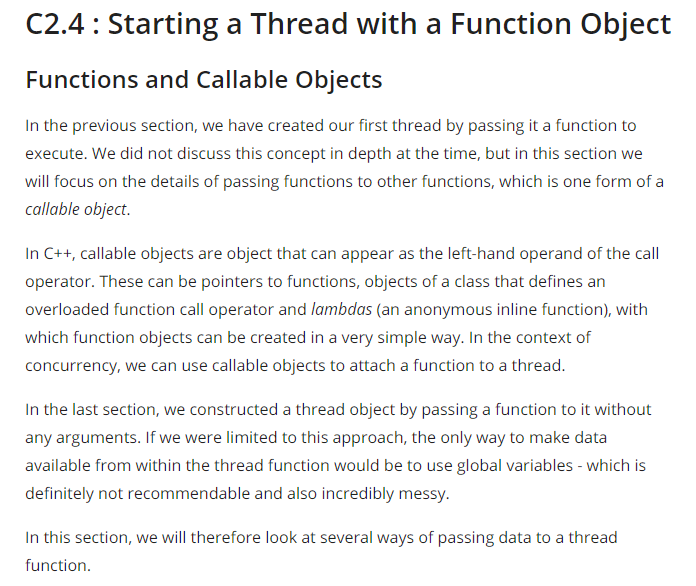
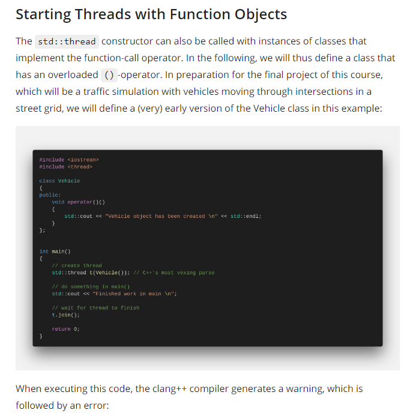

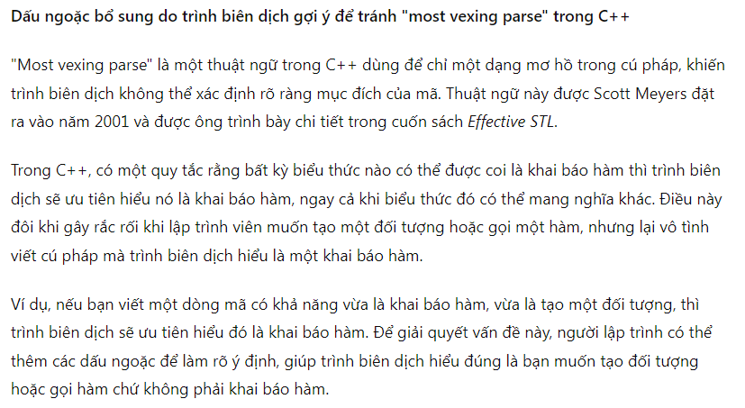
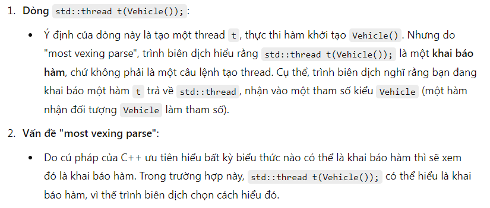

```C++
#include <iostream>
#include <thread>

class Vehicle
{
public:
    void operator()()
    {
        std::cout << "Vehicle object has been created \n" << std::endl;
    }
};


int main()
{
    // create thread 
    //std::thread t0(Vehicle()); // C++'s most vexing parse
    
    std::thread t1( (Vehicle()) ); // Add an extra pair of parantheses
    
    std::thread t2 = std::thread( Vehicle() ); // Use copy initialization
    
    std::thread t3{ Vehicle() };// Use uniform initialization with braces

    // do something in main()
    std::cout << "Finished work in main \n";

    // wait for thread to finish
    t1.join();
    t2.join();
    t3.join();

    return 0;
}
```


```C++
#include <iostream>
#include <thread>

class Vehicle
{
public:
    Vehicle(int id) : _id(id) {}
    void operator()()
    {
        std::cout << "Vehicle #" << _id << " has been created" << std::endl;
    }

private:
    int _id;
};

int main()
{
    // create thread
    std::thread t = std::thread(Vehicle(1)); // Use copy initialization

    // do something in main()
    std::cout << "Finished work in main \n";

    // wait for thread to finish
    t.join();

    return 0;
}
```

```C++
#include <iostream>

int main()
{
    // create lambdas
    int id = 0; // Define an integer variable

    //auto f0 = []() { std::cout << "ID = " << id << std::endl; }; // Error: 'id' cannot be accessed

    id++;
    auto f1 = [id]() { std::cout << "ID = " << id << std::endl; }; // OK, 'id' is captured by value

    id++;
    auto f2 = [&id]() { std::cout << "ID = " << id << std::endl; }; // OK, 'id' is captured by reference

    //auto f3 = [id]() { std::cout << "ID = " << ++id << std::endl; }; // Error, 'id' may not be modified

    auto f4 = [id]() mutable { std::cout << "ID = " << ++id << std::endl; }; // OK, 'id' may be modified

    // execute lambdas
    f1();
    f2();
    f4();

    return 0;
}
```


```C++
#include <iostream>

int main()
{
    int id = 0; // Define an integer variable

    // create lambda
    auto f = [](const int id) { std::cout << "ID = " << id << std::endl; }; // ID is passed as a parameter

    // execute function object and pass the parameter
    f(id);

    return 0;
}
```

```C++
#include <iostream>

int main()
{
    int id = 0; // Define an integer variable

    // capture by reference (immutable)
    auto f0 = [&id]() { std::cout << "a) ID in Lambda = " << id << std::endl; };

    // capture by value (mutable)
    auto f1 = [id]() mutable { std::cout << "b) ID in Lambda = " << ++id << std::endl; };
    f1(); // call the closure and execute the code witin the Lambda
    std::cout << "c) ID in Main = " << id << std::endl;

    // capture by reference (mutable)
    auto f2 = [&id]() mutable { std::cout << "d) ID in Lambda = " << ++id << std::endl; };
    f2(); 
    std::cout << "e) ID in Main = " << id << std::endl; 

    // pass parameter 
    auto f3 = [](const int id) { std::cout << "f) ID in Lambda = " << id << std::endl; };   
    f3(++id);

    // observe the effect of capturing by reference at an earlier point in time
    f0(); 

    return 0;
}
```


```C++
#include <iostream>
#include <thread>

int main()
{
    int id = 0; // Define an integer variable

    // starting a first thread (by reference)
    auto f0 = [&id]() {
        std::this_thread::sleep_for(std::chrono::milliseconds(100));
        std::cout << "a) ID in Thread (call-by-reference) = " << id << std::endl;
    };
    std::thread t1(f0);

    // starting a second thread (by value)
    std::thread t2([id]() mutable {
        std::this_thread::sleep_for(std::chrono::milliseconds(50));
        std::cout << "b) ID in Thread (call-by-value) = " << id << std::endl;
    });

    // increment and print id in main
    ++id;
    std::cout << "c) ID in Main (call-by-value) = " << id << std::endl;

    // wait for threads before returning
    t1.join();
    t2.join();

    return 0;
}
```


```C++
#include <iostream>
#include <thread>

class Vehicle
{
public:
    Vehicle() : _id(0) {}
    void addID(int id) { _id = id; }
    void setName(std::string name) { _name = name; }
    void printID()
    {
        std::cout << "Vehicle ID=" << _id << std::endl;
    }
    void printName()
    {
        std::cout << "Vehicle name=" << _name << std::endl;
    }

private:
    int _id;
    std::string _name;
};

int main()
{
    // create thread 1
    std::shared_ptr<Vehicle> v(new Vehicle);
    std::thread t1 = std::thread(&Vehicle::addID, v, 1); 

    // create thread 2
    std::thread t2 = std::thread(&Vehicle::setName, v, "MyVehicle"); 

    // wait for thread to finish
    t1.join();
    t2.join();

    // print Vehicle id
    v->printID();
    v->printName();

    return 0;
}
```

```C++
#include <iostream>
#include <thread>
#include <vector>

void printHello()
{
    // perform work
    std::cout << "Hello from Worker thread #" << std::this_thread::get_id() << std::endl;
}

int main()
{
    // create threads
    std::vector<std::thread> threads;
    for (size_t i = 0; i < 5; ++i)
    {
        // copying thread objects causes a compile error
        /*
        std::thread t(printHello);
        threads.push_back(t); 
        */

        // moving thread objects will work
        threads.emplace_back(std::thread(printHello));
    }

    // do something in main()
    std::cout << "Hello from Main thread #" << std::this_thread::get_id() << std::endl;

    // call join on all thread objects using a range-based loop
    for (auto &t : threads)
        t.join();

    return 0;
}
```


```C++
#include <iostream>
#include <thread>
#include <chrono>
#include <random>
#include <vector>

int main()
{
    // create threads
    std::vector<std::thread> threads;
    for (size_t i = 0; i < 10; ++i)
    {
        // create new thread from a Lambda
        threads.emplace_back([&i]() {

            // wait for certain amount of time
            std::this_thread::sleep_for(std::chrono::milliseconds(10 * i));

            // perform work
            std::cout << "Hello from Worker thread #" << i << std::endl;
        });
    }

    // do something in main()
    std::cout << "Hello from Main thread" << std::endl;

    // call join on all thread objects using a range-based loop
    for (auto &t : threads)
        t.join();

    return 0;
}
```


```C++
#include <iostream>
#include <thread>
#include <future>

void modifyMessage(std::promise<std::string> && prms, std::string message)
{
    std::this_thread::sleep_for(std::chrono::milliseconds(4000)); // simulate work
    std::string modifiedMessage = message + " has been modified"; 
    prms.set_value(modifiedMessage);
}

int main()
{
    // define message
    std::string messageToThread = "My Message";

    // create promise and future
    std::promise<std::string> prms;
    std::future<std::string> ftr = prms.get_future();

    // start thread and pass promise as argument
    std::thread t(modifyMessage, std::move(prms), messageToThread);

    // print original message to console
    std::cout << "Original message from main(): " << messageToThread << std::endl;

    // retrieve modified message via future and print to console
    std::string messageFromThread = ftr.get();
    std::cout << "Modified message from thread(): " << messageFromThread << std::endl;

    // thread barrier
    t.join();

    return 0;
}

```


```C++
#include <iostream>
#include <thread>
#include <future>
#include <cmath>

void computeSqrt(std::promise<double> &&prms, double input)
{
    std::this_thread::sleep_for(std::chrono::milliseconds(2000)); // simulate work
    double output = sqrt(input);
    prms.set_value(output);
}

int main()
{
    // define input data
    double inputData = 42.0;

    // create promise and future
    std::promise<double> prms;
    std::future<double> ftr = prms.get_future();

    // start thread and pass promise as argument
    std::thread t(computeSqrt, std::move(prms), inputData);

// Student task STARTS here

// Student task ENDS here    

    // thread barrier
    t.join();

    return 0;
}

```

