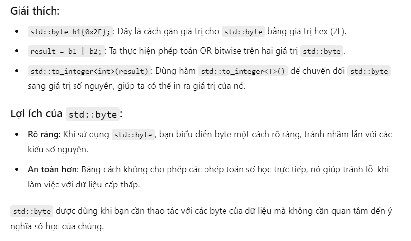
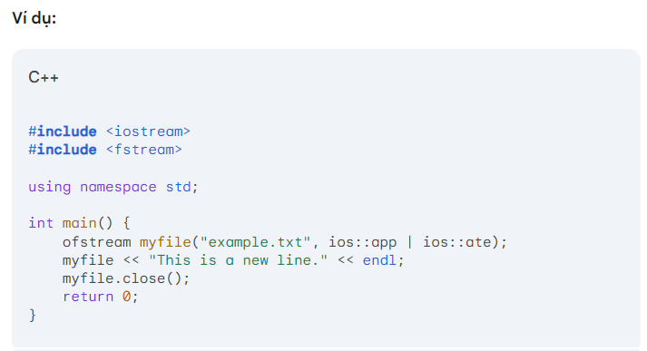
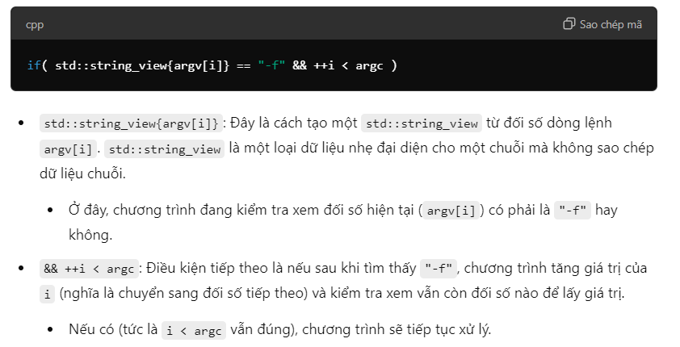
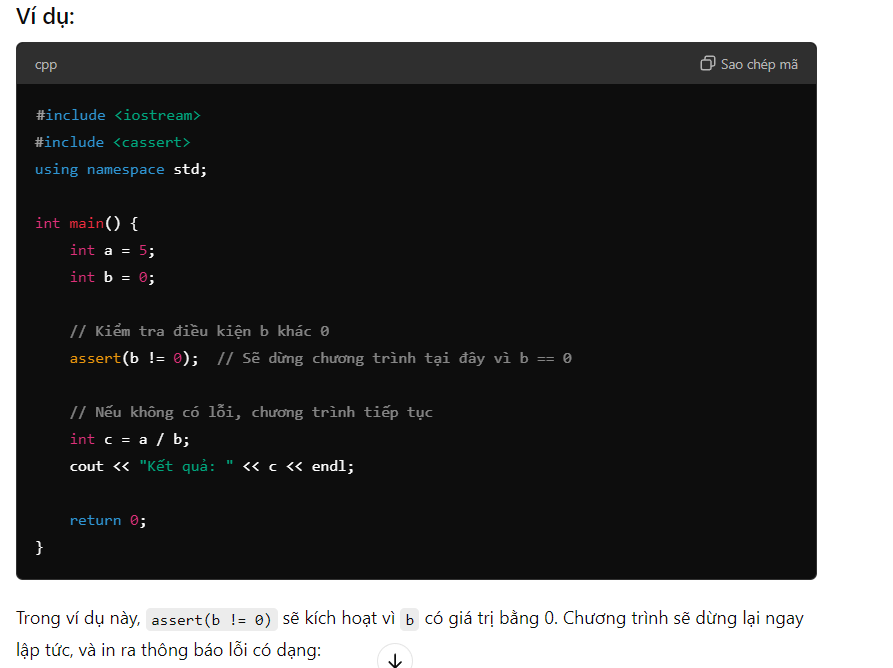

# Self-study
---
## Các cách để duyệt qua một container


## istringstream trong thư viện sstream


## Vectors


## *--recurse-submodules* trong git


## constexpr
constexpr là viết tắt của constant expression

## ifstream


## static function


## std::byte




## std::optional


## std::ios::ate




## tellg() and seek()


## ReadFile
```C++
static std::optional<std::vector<std::byte>> ReadFile(const std::string &path)
{   
    std::ifstream is{path, std::ios::binary | std::ios::ate};
    if( !is )
        return std::nullopt;
    
    auto size = is.tellg();
    std::vector<std::byte> contents(size);    
    
    is.seekg(0);
    is.read((char*)contents.data(), size);

    if( contents.empty() )
        return std::nullopt;
    return std::move(contents);
}
```


## main(int argc, const char **argv)


## std::string_view




## std::move
```C++
    if( osm_data.empty() && !osm_data_file.empty() ) {
        std::cout << "Reading OpenStreetMap data from the following file: " <<  osm_data_file << std::endl;
        auto data = ReadFile(osm_data_file);
        if( !data )
            std::cout << "Failed to read." << std::endl;
        else
            osm_data = std::move(*data);
    }
```


## #pragma once


## cstddef header file


## double m_MetricScale = 1.f;


## auto &Railways() const noexcept { return m_Railways; }


nd là viết tắt của nano degree

## get user input và trả ra ngoài


## Assert




## "struct" keyword trong C và C++


## Initializer list


## Derive là gì


## Không gọi constructor của base class ở initializer list thì sao?


## Catch ( ... )


## Deep copy and deep assigment

(*) Memory leak, dangling pointer

## Function pointer

```C++
#include <stdio.h>

// Khai báo một hàm đơn giản
int add(int a, int b) {
    return a + b;
}

int subtract(int a, int b) {
    return a - b;
}

int main() {
    // Khai báo một con trỏ hàm
    int (*operation)(int, int);

    // Gán hàm 'add' cho con trỏ hàm
    operation = &add;
    printf("Addition: %d\n", operation(5, 3));

    // Gán hàm 'subtract' cho con trỏ hàm
    operation = &subtract;
    printf("Subtraction: %d\n", operation(5, 3));

    return 0;
}
```


## Sudo apt


## std::stof


## std::replace


## .c_str()


## dirent.h
